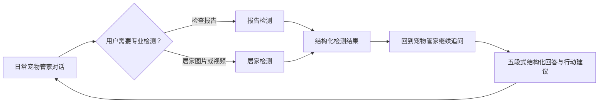
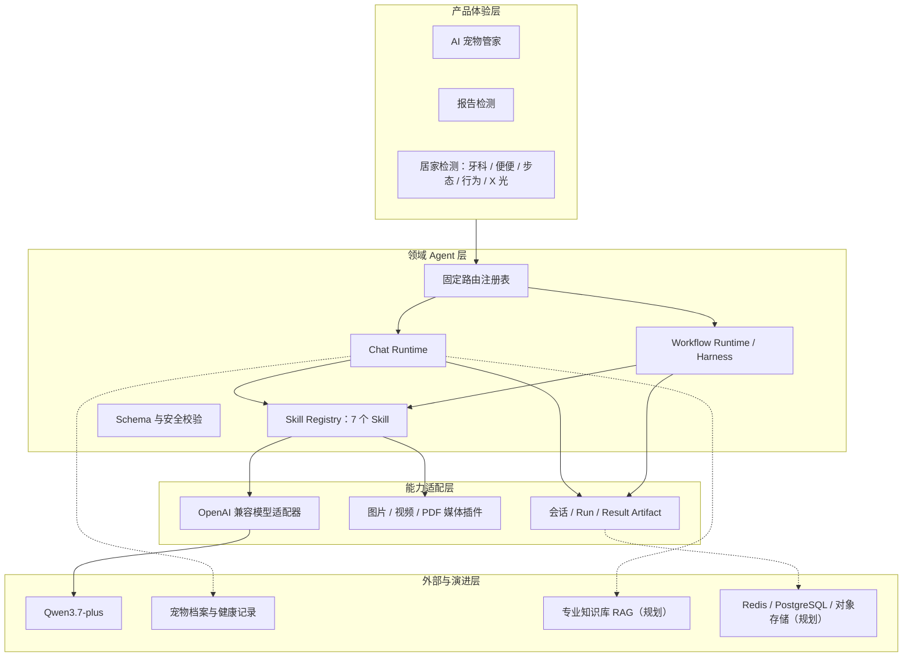
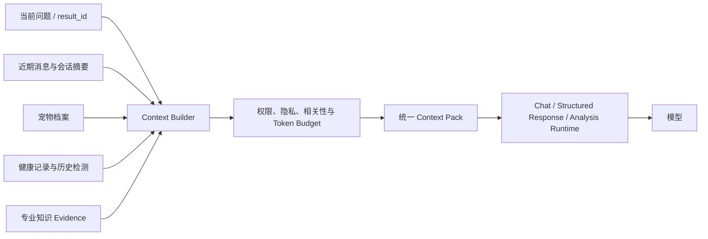
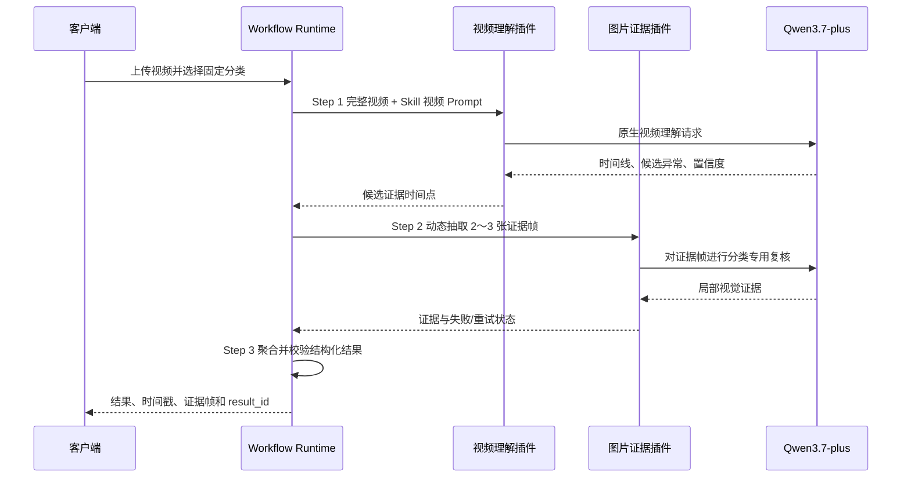
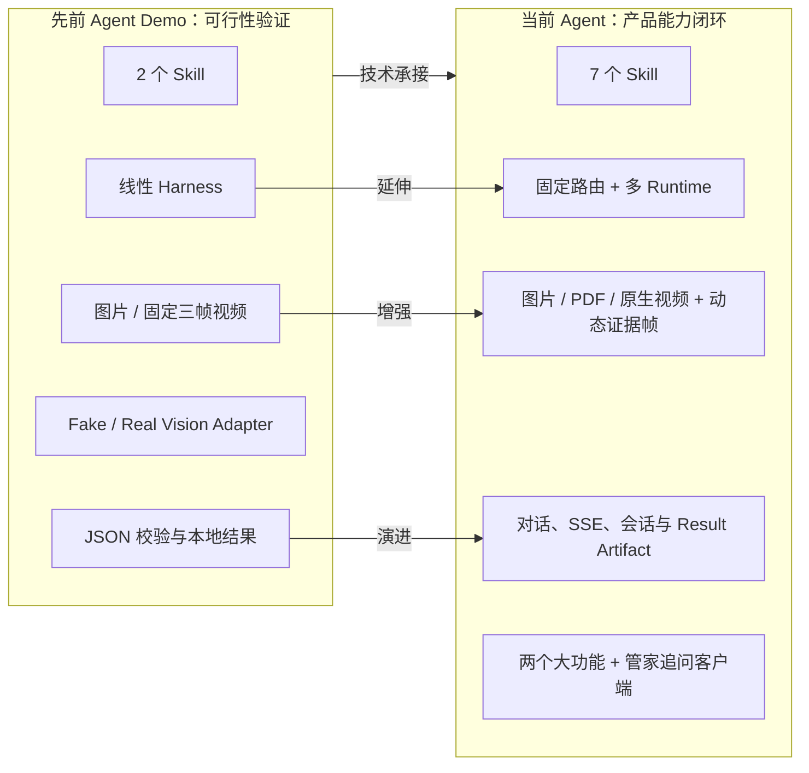

# Project F AI 宠物管家 Agent：产品与系统设计说明

> 文档版本：v1.0  
> 更新日期：2026-07-28  
> 文档定位：基于 Project F 既有 Agent Demo、产品需求、架构方案与多模态 Skill 沉淀形成的设计说明  
> 当前实现目录：`C:\Users\Administrator\Documents\Agent Demo\ProjectF-Agent1.0-Desktop`

## 1. 文档摘要

Project F AI 宠物管家 Agent 是面向宠物健康管理的垂直领域 Agent。它不是一个允许模型自由决定目标和工具的通用智能体，而是一套由产品入口确定任务、由 Skill 固化专业规则、由工作流约束执行步骤、由模型完成多模态理解和语言生成的可控智能系统。

产品以“宠物管家”作为统一对话入口，以“报告检测”和“居家检测”作为两项专业能力。检测结果不会停留在一次性 JSON，而会成为可继续追问的结果资产，由 `structured-response` Skill 转换为稳定、温暖、前端可渲染的结构化回答，从而形成完整闭环：



当前客户端已经完成上述核心闭环，并通过真实模型、多模态视频、结构化追问、自动化测试和浏览器端到端验证。生产级 RAG、持久化数据库、对象存储、任务队列、鉴权和分布式治理仍属于后续工程化范围，本文会明确区分“已经实现”和“规划设计”。

## 2. 项目来源与设计沉淀

### 2.1 Project F 的上层产品背景

Project F 的长期定位是“宠物数字生命平台”，通过多模态 AI 理解宠物的健康、行为、情绪和成长信息，并连接宠物档案、内容创作、社交、地图服务和生命周期管理。

在这一体系中，AI 宠物管家不是一个独立聊天框，而是平台的智能中枢，承担三类角色：

1. **专业养宠顾问**：理解检查报告、居家影像和宠物体征，提供分级建议。
2. **高共情对话伙伴**：结合宠物档案和历史上下文进行个性化交流。
3. **成长服务入口**：未来可连接健康趋势、智能日程、成长相册、年度回忆和数字分身等能力。

本次实现优先聚焦最有确定性、最能验证 Agent 价值的健康闭环：宠物管家对话、报告检测、五类居家检测，以及检测后的结构化追问。

### 2.2 从早期素材到当前 Agent 的演进

当前 Agent 不是从空白开始搭建，而是对 Project F 多轮产品和技术验证的整合：

| 阶段 | 既有沉淀 | 对当前设计的影响 |
|---|---|---|
| 早期模型测试 | 图片、文本、语音及宠物报告分析试验 | 证明多模态模型可覆盖核心养宠场景，同时暴露 Prompt 分散和输出不稳定问题 |
| 宠物档案与报告原型 | 宠物资料、报告 HTML/JSON 展示原型 | 确立“宠物上下文 + 结构化结果 + 可视化卡片”的产品表达 |
| AI 管家 UX 探索 | AI 管家、记忆和成长内容的交互概念 | 明确对话是统一入口，但专业检测需要独立、明确的产品入口 |
| 居家检测专项 | 牙科、便便、步态、行为、X 光样本及 Skill | 形成五类固定任务、模态差异和专业输出规范 |
| Agent 需求与架构 | Skill、Harness、模型适配、插件、流式协议、快慢通道设计 | 将一次性模型调用升级为可管理、可验证、可扩展的领域 Agent 框架 |
| 最小单元 Demo | Fake/Real Adapter、本地媒体、工作流和 Schema 测试 | 验证代码与工作流逻辑可行，并明确它不能替代生产环境验证 |
| 当前实现 | 成熟客户端、真实 Qwen 接入、原生视频理解、结构化追问闭环 | 把分散原型收敛为一个可运行、可演示、可继续产品化的统一客户端 |

这条演进路线体现了一个核心判断：Project F 真正需要的不是让模型“自行做更多事”，而是把已经被产品验证的专业能力组织成稳定、可复用、可追踪的服务。

## 3. 产品定位

### 3.1 一句话定位

**Project F AI 宠物管家 Agent 是以宠物档案和多模态健康信息为上下文、以固定专业 Skill 为能力单元、以持续对话为服务界面的宠物健康陪伴助手。**

### 3.2 用户价值

- 将分散、专业且难理解的宠物健康信息转换为用户能看懂、能行动的建议。
- 让用户在家通过图片、视频或报告完成初步观察和风险筛查。
- 保留检测结果上下文，使用户不必重复上传和描述，即可继续追问。
- 在不替代兽医诊断的前提下，帮助用户判断“先观察、如何护理、何时就医”。

### 3.3 产品能力边界

Agent 当前负责：

- 日常养宠问答和多轮上下文对话。
- 检查报告图片的识别、指标提取和解释。
- 牙科、便便、步态、行为和 X 光五类居家检测。
- 图片、视频和 PDF 的分类专用处理。
- 检测结果的结构化追问与行动建议。
- 风险提示、不确定性表达和就医引导。

Agent 不负责：

- 替代执业兽医完成确诊、开药或制定医疗处方。
- 根据一张普通图片自动启动某项专业检测。
- 让模型自行切换检测类别、调用任意工具或访问任意地址。
- 将用户私有健康数据写入公共知识库。
- 以通用自主规划循环代替固定的医疗安全流程。

### 3.4 为什么不是通用 Agent

宠物健康场景的核心指标不是“自主性最大化”，而是类别正确、步骤可复核、输出稳定、风险可控。若由模型自行判断检测类型、规划步骤和选择工具，会带来分类错误、结果漂移、资源失控和医疗责任边界不清等问题。

因此，本项目采用领域 Agent：产品决定入口，服务端固定路由，Skill 定义专业规则，Workflow 决定执行步骤，模型只在允许的环节承担视觉理解、信息提取和自然语言生成。

> 设计主张：传统通用 Agent 追求模型能做更多事情；Project F Agent 追求模型只在被验证、被约束且对用户真正有价值的地方发挥作用。

## 4. 核心设计思路

### 4.1 由产品入口确定任务，而不是由模型猜任务

用户从“报告检测”或居家检测的具体分类进入，客户端传入受支持的 `route_key`，服务端再映射到固定 Skill。模型可以在普通对话中推荐入口，但不能未经用户确认自动执行专业检测。

这样设计有三个价值：

- 用户知道自己正在使用什么能力，预期清晰。
- 每个分类可以配置独立输入、Prompt、Schema、超时和安全规则。
- 运行记录能够稳定关联到具体业务分类和 Skill 版本。

### 4.2 统一底座，但不把所有任务塞进同一条链路

宠物管家、报告检测和居家检测共享会话、Skill、模型适配、媒体处理、事件和结果资产等基础设施；但实时聊天、图片分析和视频分析的耗时、负载与输出合同不同，不应共用同一个执行器。

当前实现采用统一 API 和运行对象完成闭环；面向生产环境，设计上进一步划分：

- `chat-fast`：文字对话、普通图片和结果追问。
- `analysis-image`：报告、牙科、便便、X 光等图片任务。
- `analysis-video`：步态和行为视频任务。
- `knowledge-index`：未来知识库解析和索引任务。

### 4.3 Skill 是业务能力单元，不只是一个 Prompt

每个 Skill 同时承载：

- 角色、目标和专业判断规则。
- 明确的 Step 和步骤依赖。
- 输入模态、质量要求和失败提示。
- 图片或视频理解 Prompt。
- 输出字段、枚举和 JSON Schema。
- 医疗安全边界、禁用表达和免责声明。
- 可选的参考配置与本地验证脚本。

因此，Skill 是产品、算法和工程之间的可版本化契约。当前媒体插件会直接读取相应 `SKILL.md` 中的视觉 Prompt，避免业务代码与 Skill 内容出现两套定义。

### 4.4 模型负责理解与生成，代码负责流程与校验

模型适合处理语义、视觉、非结构化文本和自然语言表达，但不适合成为系统事实和流程权限的唯一来源。因此：

- 检测类别、宠物身份、媒体地址和结果归属由系统传入。
- 模型结果必须经过解析、字段归一化和 Schema 校验。
- 视频证据帧由工作流选取和复核，不由一次回答完全包办。
- 结构化追问固定为五段式合同，并在输出前自动修复缺失字段。
- 无法确定的内容明确表达不确定性，不生成无依据诊断。

### 4.5 多模态分析必须形成证据链

图片分析关注清晰度、主体覆盖、报告文字或目标区域；视频分析既要理解完整时间过程，也要保留可复核的关键证据。当前视频工作流采用三阶段设计：

1. 使用 Qwen 的原生视频理解能力生成完整时间线和候选异常。
2. 根据候选时间点动态抽取 2～3 张证据帧，进行分类专用图片复核；失败时重试或降级。
3. 聚合全局视频结论和局部证据，输出结构化结果。

这比固定抽取 20%、50%、80% 三帧更能理解连续动作，也避免仅凭静态帧声称精确动态指标。固定抽帧只保留为视频模型不可用时的降级方案。

### 4.6 检测结果是可继续使用的资产

一次检测完成后，系统生成 `result_id`，并将完整分析 JSON、分类、宠物和会话绑定。用户在管家中追问时，系统加载该结果和用户问题，再由 `structured-response` Skill 生成回答。

这使“检测”和“聊天”不再是两个断裂模块，而是形成：

```text
检测 → 结果资产 → 关联会话 → 追问 → 行动建议 → 后续观察
```

### 4.7 流式输出既服务体验，也服务执行透明度

- 普通聊天以 `token.delta` 持续返回文本，降低等待感。
- 结构化追问以 `structured.segment` 分段返回，客户端可以逐块展示结论、解释、建议、提醒和追问方向。
- 分析任务保留 Run 和步骤状态，使未来可以继续扩展进度、取消、重试和恢复。

## 5. 产品与技术设计框架



### 5.1 产品层

客户端只暴露三个用户可理解的入口：宠物管家、报告检测、居家检测。七个内部 Skill 不作为技术菜单展示，避免让用户理解模型和工作流概念。

### 5.2 路由层

路由表将产品分类映射为确定的 Skill 和执行方式，例如：

| 产品路由 | 固定 Skill | 输入 | 执行方式 |
|---|---|---|---|
| `report.general` | `pet-report-analysis` | 图片或 PDF | 图片分析或 PDF 逐页转图 |
| `home_check.dental` | `home-health-check-dental` | 图片 | 分类专用视觉分析 |
| `home_check.stool` | `home-health-check-stool` | 图片 | 分类专用视觉分析 |
| `home_check.gait` | `home-health-check-gait` | 视频 | 视频理解 + 动态证据帧 |
| `home_check.behavior` | `home-health-check-behavior` | 视频 | 视频理解 + 动态证据帧 |
| `home_check.xray` | `home-health-check-xray` | 图片或 PDF | 图片分析或 PDF 转页 |
| `followup.structured` | `structured-response` | 结果 JSON + 问题 | 五段式结构化生成 |

### 5.3 Runtime 层

- **Chat Runtime**：管理会话、消息、摘要、宠物上下文和 SSE 文本流。
- **Workflow Runtime / Harness**：按 Skill Step 执行媒体预处理、模型调用、重试、聚合和校验。
- **Result Context Builder**：把 `result_id` 对应的完整分析结果和追问组合成结构化回答上下文。

### 5.4 适配层

- **Model Adapter**：统一 Fake 模型与 OpenAI 兼容真实模型，隔离供应商协议差异。
- **Media Plugin**：处理图片质量、视频理解、关键帧抽取、PDF 转页和媒体限制。
- **Skill Loader**：解析 `SKILL.md`、Front Matter、Prompt 和参考 Schema。
- **Validator**：完成 JSON 提取、Pydantic/Schema 校验、字段补全和失败重试。

### 5.5 状态与核心对象

| 对象 | 作用 |
|---|---|
| `Conversation` | 绑定用户、宠物和多轮对话上下文 |
| `Message` | 保存用户或助手消息、流式状态和关联结果 |
| `Run` | 统一表示一次聊天、报告分析或居家检测执行 |
| `Skill` | 表示某一版本的专业能力定义 |
| `Artifact / Result` | 保存分析 JSON、摘要、分类、证据及 `result_id` |
| `Media Asset` | 表示上传图片、视频、PDF及其派生帧；当前为本地媒体，生产规划为对象存储引用 |

### 5.6 Context Builder：当前实现与完整蓝图

#### 5.6.1 在整体架构中的定位

Context Builder 是连接“用户当前问题”和“模型推理”的上下文组装层。它不负责直接生成答案，而是确定模型在本轮允许看到什么信息、信息来自哪里、哪些内容最相关，以及在 Token 限制内如何组织这些信息。

在 Project F 的完整架构中，Context Builder 应统一聚合：

- 当前用户、宠物和会话身份。
- 当前问题、关联媒体和检测结果。
- 近期对话与较早会话摘要。
- 宠物档案、疾病史、用药、过敏和健康记录。
- 同一宠物的历史报告及居家检测趋势。
- 经过审核的专业知识 RAG Evidence。
- 内容来源、时间、权限和 Token Budget。

目标链路为：



#### 5.6.2 当前已经具备的 Context 能力

当前版本已经实现 Context Builder 的基础能力，但尚未形成独立的 `ContextBuilder` 类。相关职责分布在单机状态仓库、`ChatRuntime`、`ChatAdapter` 和 `StructuredResponseService` 中。

| Context 能力 | 当前状态 | 当前实现 |
|---|---|---|
| 会话存储 | 已实现，单机持久化版 | `Conversation` 保存 `user_id`、宠物、标题、模式和摘要，并写入本机 JSON |
| 历史消息存储 | 已实现，单机持久化版 | 保存用户和助手的 `Message`，重启后可恢复 |
| 近期对话加载 | 已实现 | 每轮最多读取 50 条，向普通聊天模型提供最近 12 条 |
| 较早对话摘要 | 初步实现 | 将较早消息截断并拼接为最多 3000 字符的摘要 |
| 宠物档案注入 | 部分实现 | 将会话创建时传入的 `PetContext` 写入 System Prompt |
| 当前检测结果 | 已实现 | 通过 `result_id` 加载并校验结果与会话的归属关系 |
| 历史检测摘要 | 部分实现 | 结构化追问读取同一会话最近的检测结果摘要 |
| 跨会话长期记忆 | 未实现 | 不同 Conversation 之间没有统一宠物记忆 |
| 正式健康记录 | 未实现 | 尚未接入宠物档案和健康记录服务 |
| 专业知识 RAG | 未实现 | 当前专业规则主要来自 Skill 和模型能力 |
| Token Budget | 简单实现 | 使用固定消息条数和字符截断，没有动态预算 |
| 持久化 | 部分实现 | 会话、消息和分析结果写入 `runtime/desktop-history.json`；Run 与 SSE 事件仍为进程内状态 |

#### 5.6.3 普通管家对话的当前上下文链路

每次用户发送消息后，`ChatRuntime` 会执行：

```text
加载 Conversation
→ 读取最多 50 条历史消息
→ 对最近 12 条之前的消息刷新简易摘要
→ 选取最近 12 条直接对话
→ 组合宠物档案、摘要、近期消息和当前问题
→ 交给 Chat Adapter 流式生成
```

当前发送给模型的上下文结构近似为：

```text
System
├── Project F 宠物管家角色
├── 医疗安全与功能入口规则
├── 当前 PetContext
└── 较早会话摘要

Messages
├── 最近 12 条用户/助手消息
└── 当前用户问题
```

`PetContext` 当前支持 `pet_id`、名称、头像、物种、品种、年龄、体重和性别。这些信息来自客户端创建会话时的提交内容，而不是根据 `pet_id` 从 Project F 宠物档案服务主动加载。因此当前实现是“携带宠物档案”，还不是完整的“宠物档案加载器”。

#### 5.6.4 检测结果追问的当前上下文链路

检测后追问比普通聊天包含更完整的业务上下文：

```text
用户问题 + reply_to_result_id
→ 校验结果属于当前 Conversation
→ 加载并压缩当前分析 JSON
→ 加载当前 PetContext
→ 加载最近 10 条对话
→ 加载同一会话最近的历史检测摘要
→ 形成 Structured Context
→ structured-response Skill
→ 五段式结构化回答
```

Structured Context 当前包含：

- `source_type`：报告检测或居家检测。
- `analysis_json`：当前检测结果的重点摘要、异常项和建议。
- `user_question`：本轮追问。
- `pet_profile`：宠物名称、品种、年龄、体重和性别。
- `history_summary`：同一会话内最近的其他检测摘要。
- `conversation_history`：近期对话内容。

这一实现已经让检测结果从一次性响应转变为可继续使用的上下文资产，但尚未覆盖该宠物在其他会话中的检测历史、医院记录和长期趋势。

#### 5.6.5 当前实现的职责分布

```text
InMemoryState
├── 保存 Conversation、Message、Run、Event 和 Result
├── 查询近期消息及检测结果
└── 生成简易会话摘要

ChatRuntime
├── 进入 context_building 状态
├── 决定本轮加载的消息范围
├── 组织普通聊天或结果追问分支
└── 发送 context.ready 事件

ChatAdapter
├── 将 PetContext 写入 System Prompt
├── 注入较早会话摘要
└── 发送最近消息给模型

StructuredResponseService
├── 压缩检测分析 JSON
├── 组合宠物、对话和历史检测
└── 生成并校验结构化追问上下文
```

当前代码已经出现 `context_building` Run 状态和 `context.ready` 事件，说明 Context Builder 的运行位置已经预留；但上下文选择、压缩和数据读取逻辑仍然分散，后续应收敛为独立组件。

#### 5.6.6 与大架构目标的主要差距

1. **生产级持久化尚未完成**：会话、消息、摘要和分析结果已具备本机 JSON 持久化，但 Run、SSE 事件、并发写治理和数据库迁移尚未完成。
2. **没有真实档案加载**：只使用客户端提交的 PetContext，没有根据用户和 `pet_id` 查询最新宠物档案并校验归属。
3. **没有跨会话记忆**：同一宠物在不同 Conversation 中的事实和健康变化无法互通。
4. **摘要不是语义记忆**：当前只是消息截断和拼接，不能提取稳定事实、识别更正、去重或按问题召回。
5. **没有健康记录聚合**：尚未接入疾病史、用药、过敏、疫苗、报告历史和健康趋势。
6. **没有 RAG Evidence**：无法按当前问题检索经过审核的专业知识，也没有来源引用和证据不足降级。
7. **没有动态 Token 管理**：目前通过固定 12 条消息和字符上限截断，不能按信息价值分配上下文预算。
8. **缺少上下文可观测性**：尚未完整记录每条上下文的来源、版本、选入原因、Token 成本和是否命中回答。

综合判断：当前已经具备可支撑单机会话和检测追问的基础 Context 能力，完成度约为完整架构目标的 35%～40%；会话上下文和结果上下文可用，但长期用户/宠物上下文仍未形成。

#### 5.6.7 推荐的 Context Builder 升级结构

下一阶段应将现有分散逻辑收敛为独立 `ContextBuilder`，并让不同 Runtime 只消费统一的 `ContextPack`：

```text
ContextBuilder
├── build_chat_context(...)
├── build_analysis_context(...)
└── build_followup_context(...)

Context Sources
├── ConversationRepository
├── MessageRepository
├── PetProfilePort
├── HealthRecordPort
├── AnalysisResultRepository
├── MemoryRepository
└── RagEvidencePort

Context Policies
├── OwnershipPolicy
├── RelevancePolicy
├── PrivacyPolicy
├── FreshnessPolicy
└── TokenBudgetPolicy
```

建议的统一 `ContextPack`：

```json
{
  "identity": {
    "user_id": "user_001",
    "pet_id": "pet_001"
  },
  "pet_profile": {},
  "current_turn": {},
  "recent_messages": [],
  "conversation_summary": {},
  "long_term_memories": [],
  "current_analysis": {},
  "historical_analyses": [],
  "health_records": [],
  "evidence": [],
  "safety_context": {},
  "context_meta": {
    "sources": [],
    "token_budget": 12000
  }
}
```

上下文可按五层管理：

1. **L0 当前任务**：当前问题、媒体、关联 `result_id` 和任务参数。
2. **L1 近期对话**：最近若干轮原始消息。
3. **L2 会话记忆**：语义摘要、用户更正、待确认信息和长期有效事实。
4. **L3 宠物健康上下文**：宠物档案、健康记录、历史报告和趋势。
5. **L4 专业证据**：与当前问题相关的审核知识和引用。

推荐分三步升级：

1. 先建立独立 `ContextBuilder`、`ContextPack`、Repository 接口和结构化语义摘要，继续使用内存 Repository 验证行为。
2. 再将会话、消息、Run、结果和长期记忆迁移到 PostgreSQL/Redis，并接入真实宠物档案与健康记录服务。
3. 最后接入专业 RAG、引用、动态 Token Budget、上下文审计和质量评测。

这种演进方式可以继续承接当前 `ChatRuntime` 和 `structured-response` Skill，不需要推翻已经跑通的聊天、检测与追问闭环。

## 6. 已实现的产品功能

### 6.1 AI 宠物管家

- 支持创建会话和多轮消息。
- 支持宠物名称、物种、品种、年龄等档案上下文。
- 支持 SSE 流式回复，事件类型为 `token.delta`。
- 保留近期消息，并为较早历史生成会话摘要。
- 对呼吸困难、抽搐、昏迷、中毒、大出血、无法排尿等高危信号优先给出就医提示。
- 普通对话可以推荐报告检测或居家检测入口，但不会自行启动专业检测。
- 支持 Fake 模型演示和真实 OpenAI 兼容模型切换。

### 6.2 报告检测

报告检测内置 `pet-report-analysis` Skill，已实现：

1. 上传 JPG、JPEG、PNG、WEBP 报告图片或多页 PDF；PDF 以 200 DPI 转图并按页码顺序分析。
2. 识别报告类型、日期、医院和宠物基础信息。
3. 提取指标名称、数值、单位和参考范围。
4. 标记正常、临界和异常项目。
5. 生成指标解释、偏差说明、风险分级和行动建议。
6. 输出前端可直接消费的结构化 JSON。
7. 保存 `result_id`，支持回到宠物管家继续追问。

### 6.3 居家检测

| 分类 | Skill | 输入模态 | 已实现能力 |
|---|---|---|---|
| 牙科评估 | `home-health-check-dental` | 图片 | 牙结石、牙龈、清洁度、风险提示与护理建议 |
| 便便分析 | `home-health-check-stool` | 图片 | 颜色、形态、质地、异常信号和消化健康建议 |
| 步态分析 | `home-health-check-gait` | 视频 | 步伐节律、四肢协调、异常时间点和关键帧证据 |
| 行为评估 | `home-health-check-behavior` | 视频 | 情绪、压力、异常行为、时间线和关键帧证据 |
| X 光片解读 | `home-health-check-xray` | 图片、PDF | 影像信息、骨骼、关节和软组织可见表现 |

每一类居家检测都由独立 Skill 明确 Step、媒体要求、插件 Prompt、输出字段和医疗安全规则，不共享一段笼统的视觉提示词。

### 6.4 检测后的管家追问

该能力明确使用 `structured-response` Skill，而不是普通聊天 Prompt。执行过程为：

1. 客户端携带 `result_id` 和用户问题发起追问。
2. 服务端校验检测结果是否属于当前会话。
3. 加载完整分析 JSON、分类信息和问题。
4. 按 `structured-response` Skill 生成五段式 JSON。
5. 校验段落、重点高亮、建议问题和风险表达。
6. 通过 `structured.segment` 流式返回各段内容。

固定五段回答为：

| 段落 | 目标 |
|---|---|
| 结论 | 直接回答用户最关心的问题 |
| 解释 | 用通俗语言说明检测结果和相关证据 |
| 建议 | 给出可执行、分优先级的下一步动作 |
| 提醒 | 说明不确定性、观察点和就医红旗信号 |
| 继续追问 | 提供与当前结果相关的建议问题 |

这样既保留管家式温暖表达，也让前端能够稳定渲染卡片、高亮内容和建议操作。

### 6.5 成熟客户端体验

- 宠物管家、报告检测和居家检测形成统一视觉和导航体系。
- 五类居家检测使用明确卡片入口和模态提示。
- 文件上传、执行进度、错误状态和结果卡片均有对应反馈。
- 普通聊天和结构化追问均采用流式展示。
- 完成检测后可直接回到管家追问，减少重复描述。
- 客户端不展示 Skill、模型端点或底层插件等工程概念。

## 7. 关键工作流设计

### 7.1 普通对话

```text
创建/恢复 Conversation
→ 组合宠物档案、近期消息和会话摘要
→ 进行安全规则检查
→ 调用 Chat 模型
→ 以 token.delta 流式输出
→ 保存消息和更新摘要
```

### 7.2 报告图片

```text
媒体格式与大小校验
→ 加载 pet-report-analysis Skill
→ 发送报告图片和报告专用 Prompt
→ 提取结构化 JSON
→ 校验指标字段与状态枚举
→ 生成摘要、异常项和行动建议
→ 保存 result_id
```

### 7.3 牙科与便便图片

```text
媒体质量检查
→ 固定分类路由
→ 读取对应 Skill 的视觉 Prompt
→ 分类专用图片理解
→ Schema 校验与必要修复
→ 输出结果卡片并保存 result_id
```

### 7.4 步态与行为视频



原生视频理解最多等待 75 秒；未完成时自动降级为顺序帧理解，再继续关键帧复核与结构化汇总。降级会记录在运行时元数据中，结果会降低置信度，并避免声称静态帧不能支持的动态结论。每次失败同时保存步骤级诊断记录，便于直接定位媒体、模型、关键帧或校验环节。

### 7.5 X 光图片与 PDF

```text
识别输入类型
→ 图片直接进入影像工作流
→ PDF 使用 pdftoppm 以 JPEG、200 DPI 转页
→ 逐页进行 X 光专用视觉理解
→ 聚合可见骨骼、关节和软组织表现
→ 加入影像局限和兽医复核提示
→ 输出结构化结果并保存 result_id
```

## 8. Skill 能力框架

项目当前加载 7 个 Skill：

| Skill | 所属产品功能 | 核心职责 |
|---|---|---|
| `pet-report-analysis` | 报告检测 | 报告识别、指标提取、异常解释和建议 |
| `home-health-check-dental` | 居家检测 | 口腔与牙齿图片分析 |
| `home-health-check-stool` | 居家检测 | 粪便图片分析 |
| `home-health-check-gait` | 居家检测 | 行走视频理解和步态证据分析 |
| `home-health-check-behavior` | 居家检测 | 日常行为视频理解和情绪/压力观察 |
| `home-health-check-xray` | 居家检测 | X 光图片或 PDF 影像解读 |
| `structured-response` | 管家追问 | 将检测 JSON 与问题转换为五段式结构化回答 |

Skill 位于 `skill-definitions/<skill-name>/SKILL.md`。它们与产品功能的关系是“内嵌式能力”，而不是让用户单独安装或选择的插件。

设计上，Skill 与代码分工如下：

| Skill 负责 | 运行时代码负责 |
|---|---|
| 专业语义、分析标准、Prompt、输出要求 | 固定路由、权限和任务生命周期 |
| Step 的业务目标与依赖 | 媒体读取、转码、抽帧和模型协议 |
| 医疗安全边界和表达规范 | 超时、重试、降级、日志和错误码 |
| Schema 和枚举要求 | JSON 提取、类型校验和自动修复 |

这一分工解决了早期“Prompt 直接拼在服务代码里”的问题，使模型更换、Skill 迭代和效果对比不再要求修改核心业务流程。

## 9. 技术实现与选型逻辑

| 层次 | 当前选择 | 选择原因 |
|---|---|---|
| 服务语言 | Python | 多模态、数据校验和模型生态成熟，适合快速迭代 |
| API | FastAPI | 异步接口、类型约束、OpenAPI 和 SSE 支持完整 |
| 编排 | 轻量 Harness / Workflow Runtime | 当前流程有限且确定，边界比通用自主 Agent 更可控 |
| Skill 格式 | Markdown + YAML Front Matter + JSON Schema | 便于产品、算法和工程共同维护与版本化 |
| 模型适配 | OpenAI-compatible Adapter | 隔离真实供应商协议，支持 Fake/Real 模型切换 |
| 当前模型 | `qwen3.7-plus` | 同时服务文本、图片与原生视频理解 |
| 流式协议 | SSE | 浏览器友好，适合聊天 token 和结构化分段事件 |
| 校验 | Pydantic + JSON Schema | 将模型生成转换为可靠的前端合同 |
| PDF 媒体 | `pdftoppm` | 将检测报告或 X 光 PDF 稳定转换为高质量逐页 JPEG |
| 当前状态 | 本机 JSON + 进程内运行态 | 会话、消息、分析结果可跨重启恢复；Run/SSE 仍在内存，生产环境需外置 |

没有直接采用 LangGraph、通用自主规划平台或复杂多 Agent 的原因，是一期七个 Skill 的流程已经明确。轻量 Harness 更容易做到固定路由、步骤可视、失败可重试和输出可验证。若未来出现跨小时任务、人工审批或复杂补偿，再评估 Temporal 等持久化工作流引擎。

## 10. 先前 Agent Demo 与当前 Agent 的技术关系

### 10.1 总体关系：继承验证底座，延伸领域运行时，改变产品边界

先前 `agent-demo` 的任务是验证“多模态媒体能否通过 Skill、Harness、模型适配和 Schema 校验形成一条可运行链路”。它是一套最小技术单元，重点回答代码和工作流逻辑是否可行。

当前 `ProjectF-Agent1.0-Desktop` 在此基础上继续开发，并没有推翻原 Demo 的核心抽象。它保留已经验证过的执行底座，将能力从两个实验 Skill 扩展为七个正式 Skill，同时增加对话、固定产品路由、结果资产、结构化追问和成熟客户端，使技术单元转变为完整产品闭环。

两者的关系可概括为：



这不是“Demo 版与正式版完全不同的两套系统”，也不是对 Demo 代码的简单包装，而是一次保持可用内核、逐层增加产品能力的增量演进。

### 10.2 技术承接：哪些能力直接来自先前 Demo

#### 1. Python、FastAPI 与异步调用方式

当前 Agent 延续 Python + FastAPI 的服务形态，保留异步模型调用、Pydantic 请求响应模型和 OpenAPI 接口能力。旧 Demo 的 `/health/live`、Skill 查询和任务提交思路继续存在，并在当前版本扩展为会话、事件、Run、报告检测和居家检测 API。

#### 2. 轻量 Harness 与步骤 Trace

旧 Demo 已形成以下固定执行骨架：

```text
load_skill
→ prepare_media
→ model_analysis
→ normalize_result
→ validate_output
→ save_result
```

当前 `Harness` 继续使用这条骨架，并保留 `_step()` 对每一步记录 `status`、`elapsed_ms` 和失败原因的机制。这样既保护了旧 Demo 已验证的正确性，又允许居家检测在 `model_analysis` 环节进入更细的分类专用工作流。

#### 3. Skill Registry 与 Markdown Skill

旧 Demo 的 `SkillDefinition`、`SkillRegistry` 和 `SKILL.md` 解析方式被直接承接。当前版本将 Skill 目录从原素材路径收敛到项目内的 `skill-definitions/`，并把数量从报告分析、步态分析两个 Skill 扩展到七个。

Skill 仍然是模型行为和业务规则的主要来源，核心服务不重新维护一套同义 Prompt。

#### 4. MediaArtifact 与 MediaProcessor

旧 Demo 已经定义统一的 `MediaArtifact`，包含媒体类型、路径、MIME、大小、宽高、时长、帧率和关键帧；`MediaProcessor` 负责图片读取、视频探测和抽帧。

当前版本继续沿用这一媒体抽象，因此后续增加牙科图片、便便图片、行为视频和 X 光 PDF 时，无需改变 Harness 对媒体对象的基本认知。

#### 5. Fake/Real Model Adapter

旧 Demo 通过统一接口隔离 `FakeVisionAdapter` 与 `OpenAICompatibleVisionAdapter`。当前版本继续保留 Fake 模式用于离线演示、单元测试和回归，同时保留 OpenAI 兼容协议接入真实 Qwen 模型。

这种承接让测试不依赖外部网络和模型配额，也使真实模型更换不影响上层工作流合同。

#### 6. 结构化结果与确定性字段覆盖

旧 Demo 已经要求模型返回 JSON，并通过 Validator 检查关键字段；同时由代码覆盖宠物信息、媒体地址、分类和检测时间等系统字段，防止模型或 Skill 示例数据污染结果。

当前版本保留这一原则，并把它扩展到五类居家检测和结构化追问。模型可以生成分析内容，但不能决定宠物身份、结果归属、媒体位置和业务路由。

#### 7. 本地输出与测试替身

旧 Demo 的本地 JSON 输出、CLI、Fake Adapter 和测试目录被继续保留，作为当前 Agent 的兼容调试能力。这些能力支持在不启动完整客户端或不调用真实模型时快速验证单个 Skill。

### 10.3 技术延伸：当前 Agent 在原底座上增加了什么

#### 1. 从两个 Skill 扩展为七个领域 Skill

旧 Demo 的 `TaskRequest.skill_name` 只允许：

- `pet-report-analysis`
- `home-health-check-gait`

当前版本增加牙科、便便、行为、X 光和结构化追问，形成一期完整 Skill 组合。新增能力并非仅复制 Prompt，而是分别定义媒体合同、执行 Step、视觉 Prompt、Schema 和安全边界。

#### 2. 增加固定 Route Registry

旧 Demo 由调用方直接传 `skill_name`，适合开发测试，但会将内部实现暴露给产品端。当前 Agent 新增 `RouteRegistry`：客户端只表达 `report.general`、`home_check.gait` 等产品意图，服务端将其确定性映射到 Skill、输入类型、执行通道和超时。

这是从“技术 API”向“产品 API”的关键延伸，也落实了模型不能自由选择检测分类的安全原则。旧 `/v1/agent/tasks` 接口仍作为兼容接口保留，但已标记为 deprecated。

#### 3. 从单一 Harness 扩展为多 Runtime 协作

旧 Demo 的所有任务都进入同一个 `Harness.execute()`。当前版本在保留 Harness 的同时新增：

- `ChatRuntime`：负责多轮对话、上下文摘要和流式回复。
- `HomeCheckWorkflow`：负责五类居家检测的分类专用多模态流程。
- `StructuredResponseService`：负责检测结果追问和五段式结构化输出。
- `InMemoryState`：统一管理 Conversation、Message、Run、Event 和 Analysis Result。

这意味着 Harness 从“整个 Agent”变为“专业分析执行器的一部分”，其边界更清晰。

#### 4. 从任务响应扩展为统一状态对象

旧 Demo 只有 `TaskRequest`、`TaskResponse` 和步骤 Trace，任务结束后写入本地 JSON。当前版本增加：

- `Conversation`：用户与宠物的持续会话。
- `Message`：用户和助手消息。
- `Run`：聊天或分析执行状态。
- `RunEvent`：流式事件和步骤事件。
- `AnalysisResultRecord`：可通过 `result_id` 引用的检测资产。

这为结果追问、任务取消、状态查询和未来持久化提供了统一语义。

#### 5. 从固定抽帧延伸到原生视频理解

旧 Demo 使用 FFmpeg 在视频 20%、50%、80% 三个时间点抽取固定关键帧，再将图片交给视觉模型。它适合验证视频预处理和多帧输入，但无法可靠理解连续动作、异常出现时刻和行为持续时间。

当前版本保留固定抽帧作为降级能力，主链路升级为：

```text
完整视频原生理解
→ 获取时间线与候选异常时间点
→ 动态选择 2～3 个证据帧
→ 分类专用图片复核
→ 聚合全局动态结论与局部视觉证据
```

因此，视频能力从“把视频当作三张图片”延伸为“先理解时间过程，再用图片证据复核”。

#### 6. 从图片/视频扩展到 X 光 PDF

旧 `MediaProcessor` 只处理图片和视频。当前版本加入 PDF 类型和 `pdftoppm` 转页流程，支持将多页 X 光 PDF 以 200 DPI 转换为 JPEG 后逐页分析，再聚合影像结果。

#### 7. 从同步结果扩展到 SSE 双流协议

旧 Demo 的任务 API 在执行完成后一次性返回 `TaskResponse`。当前版本增加两种流式体验：

- 普通管家对话使用 `token.delta`。
- 检测后结构化追问使用 `structured.segment`。

这使用户可以即时看到生成过程，也为前端按段落渲染结构化回答提供稳定事件合同。

#### 8. 从一次性结果延伸为可追问结果资产

旧 Demo 的结果以 `output_file` 和响应 JSON 结束，不存在后续语义。当前版本为分析结果生成 `result_id`，绑定会话和宠物，并在后续追问中加载完整分析 JSON。

这是最重要的产品延伸：检测不再是一项孤立工具，而成为宠物管家的上下文和长期健康服务入口。

#### 9. 从后端验证扩展到完整客户端

旧 Demo 主要面向 CLI、API 和测试人员。当前版本增加统一 Web 客户端，将 Skill 隐藏在报告检测、居家检测和管家追问之后，补充导航、上传、进度、错误、结果卡片和流式交互。

### 10.4 技术区别：两代系统解决的问题不同

| 技术维度 | 先前 `agent-demo` | 当前 `ProjectF-Agent1.0-Desktop` | 区别的原因 |
|---|---|---|---|
| 核心目标 | 验证最小多模态编排可行性 | 验证完整领域 Agent 产品闭环 | 从工程试验进入产品验证 |
| 服务对象 | 开发与架构验证人员 | 真实产品用户和后续 APP/BFF | 接口需由技术语义转为产品语义 |
| Skill 数量 | 报告、步态共 2 个 | 报告、5 类居家检测、结构化追问共 7 个 | 覆盖一期健康模块 |
| 入口方式 | 调用方直接提交 `skill_name` | 产品分类 → `route_key` → 固定 Skill | 防止误选和暴露内部实现 |
| 执行结构 | 单一线性 Harness | Chat Runtime + Harness + HomeCheck Workflow + Structured Response | 不同任务需要不同上下文和输出合同 |
| 对话能力 | 无持续会话 | 多轮会话、摘要、SSE、取消和状态 | 管家成为持续服务入口 |
| 视频处理 | 固定 20%/50%/80% 抽帧 | 原生视频理解 + 动态证据帧，固定帧降级 | 保留连续动作和时间证据 |
| 媒体类型 | 图片、视频 | 图片、视频、PDF | 支持完整居家检测分类 |
| 结果形态 | `TaskResponse` + 本地 JSON | 结果卡片 + `result_id` + 关联追问 | 结果成为可复用业务资产 |
| 流式输出 | 无 | `token.delta`、`structured.segment` | 提升等待体验并稳定前端渲染 |
| 状态模型 | 单次任务与 Trace | Conversation、Message、Run、Event、Result | 支撑完整用户旅程 |
| 模型职责 | 单次视觉分析 | Chat、图片、原生视频、证据帧、结构化生成 | 按任务拆分 Prompt 与输出合同 |
| 前端 | CLI/API 为主 | 成熟 Web 客户端 | 由技术验证进入交互验证 |
| 生产基础设施 | 本地文件和内存 | 当前仍以本地/内存为主 | 两者都未宣称完成分布式生产化 |

其中最后一项非常重要：当前 Agent 的产品能力明显超过旧 Demo，但它仍是单机产品化 Demo。它没有因为增加客户端和真实模型就自动具备 Redis 队列、PostgreSQL 持久化、对象存储、RAG、鉴权和生产 SLA。技术承接与产品延伸已经完成，分布式工程化仍需按路线继续建设。

### 10.5 代码模块承接与拆分映射

| 先前 Demo 模块 | 当前处理方式 | 当前模块 |
|---|---|---|
| `app/api.py` | 保留 FastAPI 入口，扩展资源接口、SSE、Run 和分类上传 | `app/api.py` |
| `app/harness.py` | 保留步骤执行与 Trace，分出居家多模态和对话 Runtime | `app/harness.py`、`app/home_check_workflow.py`、`app/chat_runtime.py` |
| `app/model_adapter.py` | 保留 Fake/Real Vision，增加原生视频、聊天和结构化回答适配 | `app/model_adapter.py`、`app/chat_adapter.py`、`app/structured_response.py` |
| `app/skill_loader.py` | 沿用 Registry 和定义对象，Skill 路径和数量扩展 | `app/skill_loader.py`、`skill-definitions/` |
| `app/media.py` | 沿用 MediaArtifact，增加 PDF、视频理解所需媒体能力 | `app/media.py` |
| `app/validators.py` | 保留结果校验，扩展更多分类及结构化回答校验 | `app/validators.py`、`app/structured_response.py` |
| `app/schemas.py` | 保留 Pet/Task/Trace，新增会话、消息、Run、事件和结果记录 | `app/schemas.py` |
| `app/config.py` | 延续环境化模型设置与 OpenAI 兼容配置 | `app/config.py` |
| 无对应模块 | 新增产品路由与模型不可越权的固定映射 | `app/route_registry.py` |
| 无对应模块 | 新增会话、Run、事件和结果资产的运行状态 | `app/state.py` |
| 无对应模块 | 新增成熟客户端 | `static/` |

模块映射说明了当前代码的演进方式：复用经 Demo 验证的窄接口，在外层新增产品语义，在复杂能力处拆出专用 Runtime，而不是将所有新逻辑持续堆进原 `Harness`。

### 10.6 同一任务在两代系统中的调用链对照

先前 Demo 的步态分析：

```text
TaskRequest(skill_name, media_path)
→ Harness
→ SkillRegistry
→ MediaProcessor 固定抽取三帧
→ Vision Adapter
→ Validator
→ TaskResponse + 本地 JSON
```

当前 Agent 的步态分析：

```text
用户选择“居家检测 / 步态”并上传视频
→ 产品 API 生成 route_key=home_check.gait
→ RouteRegistry 固定映射 home-health-check-gait
→ 创建 Run 并绑定会话、宠物和媒体
→ Harness 加载 Skill、准备媒体
→ HomeCheckWorkflow 调用原生视频理解
→ 动态抽取证据帧并进行图片复核
→ 聚合、Schema 校验和安全表达
→ 保存 AnalysisResultRecord 与 result_id
→ 客户端展示结果
→ 用户回到管家基于 result_id 继续追问
→ structured-response Skill 流式生成五段式回答
```

前者验证的是“一条分析链能否运行”，后者完成的是“用户如何进入、任务如何被约束、结果如何呈现并继续产生价值”的完整技术闭环。

### 10.7 演进结论

当前版本的意义不只是“把 Demo 做得更好看”，而是完成了五层技术升级：

1. **底层复用**：继续使用 Harness、Skill、Media、Adapter、Validator 和 Trace，降低重写风险。
2. **能力扩展**：从两个 Skill 扩展为七个，并覆盖图片、视频、PDF 和结构化生成。
3. **架构分层**：从单一任务执行器扩展为路由、聊天、分析、结构化回答和状态协作。
4. **产品闭环**：从一次性结果扩展为 `result_id`、会话绑定和持续追问。
5. **能力升级**：从固定视频抽帧升级为原生视频理解与证据帧复核。

因此，旧 Demo 是当前 Agent 的技术验证基座；当前 Agent 是对该基座的领域化、产品化和多模态深化，而生产级基础设施则是下一阶段延伸目标。

## 11. 产品闭环与长期价值

### 11.1 对用户

用户不用理解模型、插件和 Skill，只需要在明确场景下上传材料；系统将复杂健康信息转化为易懂的结论、证据、建议和风险提醒。

### 11.2 对产品

“检测后可追问”把工具型功能变成持续服务。随着宠物档案、历史检测和日常记录积累，AI 管家能够从回答单个问题演进为长期健康陪伴入口。

### 11.3 对工程

固定路由、Skill、Workflow、模型适配和 Schema 形成稳定边界。新增能力时可以增加新 Skill 和路由，而不是复制一套接口、Prompt 和页面逻辑。

### 11.4 对运营与专业团队

专业规则从业务代码中分离后，能够按 Skill 版本进行审核、测试、效果比较和灰度发布，也便于未来将知识来源、模型版本、结果质量和用户反馈纳入评测体系。

## 12. 验证结果

当前版本已完成以下验证：

- 自动化测试共 53 项通过。
- 普通对话 SSE 流式协议跑通。
- 报告检测真实链路跑通。
- 五类居家检测工作流已接入统一客户端。
- Qwen 原生视频理解和动态证据帧链路通过真实调用测试。
- 检测结果关联 `result_id` 的结构化追问通过真实调用测试。
- 真实 X 光素材已通过“模型 → 分类 Skill → 字段质量校验 → JSON 落盘”完整回归；结构化追问输出 13 个段、2 条主要发现、3 条分级建议和 2 个推荐追问。
- 浏览器端到端交互检查通过，无控制台错误或警告。
- Fake 模型仍可用于离线演示和回归测试。

这些结果证明当前客户端和核心工作流具备软件层面的可行性，但不等同于已经完成生产容量、分布式恢复、网络故障和安全合规验证。

## 13. 当前边界与产品化路线

### 13.1 当前尚未完成

- 会话、消息和分析结果已支持本机 JSON 持久化；Run 和 SSE 事件仍为单进程内存，运行中断后不会恢复。
- 尚未接入 Redis、PostgreSQL、对象存储和独立任务队列。
- 尚未接入正式用户鉴权、租户隔离和完整审计。
- 尚未建设专业知识 RAG、引用、兽医审核和索引版本体系。
- 媒体仍由当前服务接收，未实现客户端直传对象存储。
- 尚未完成大并发、故障恢复、成本监控和生产 SLA 验证。

### 13.2 推荐演进顺序

1. **数据与身份底座**：持久化 Conversation、Message、Run、Result 和宠物关联，补齐鉴权与审计。
2. **媒体与任务隔离**：对象存储直传，拆分聊天、图片和视频 Worker，支持幂等、取消、重试和恢复。
3. **专业知识 RAG**：建设审核、版本、混合召回、引用和证据不足降级能力。
4. **质量与模型治理**：建立 Golden Dataset、Skill 版本评测、多模型 A/B、成本与时延监控。
5. **长期管家能力**：接入健康趋势、智能日程、实时语音、成长内容和数字分身。

## 14. API 与工程附录

### 14.1 核心 API

| 能力 | 接口 |
|---|---|
| 存活/就绪 | `GET /health/live`、`GET /health/ready` |
| Skill 与路由 | `GET /v1/skills`、`GET /v1/routes` |
| 创建会话 | `POST /v1/conversations` |
| 查询历史会话 | `GET /v1/conversations?user_id={user_id}&pet_id={pet_id}` |
| 删除历史会话 | `DELETE /v1/conversations/{conversation_id}` |
| 查询消息 | `GET /v1/conversations/{conversation_id}/messages` |
| 发送消息 | `POST /v1/conversations/{conversation_id}/messages` |
| 会话事件流 | `GET /v1/conversations/{conversation_id}/events` |
| 查询/取消 Run | `GET /v1/runs/{run_id}`、`POST /v1/runs/{run_id}/cancel` |
| 报告检测上传 | `POST /v1/analysis/report/{category}/upload` |
| 居家检测上传 | `POST /v1/analysis/home-check/{category}/upload` |

### 14.2 主要目录

```text
ProjectF-Agent1.0-Desktop/
├── app/                    # API、Runtime、模型、媒体、状态和校验
├── config/                 # 路由及运行配置
├── skill-definitions/      # 7 个领域 Skill
├── static/                 # 成熟 Web 客户端
├── tests/                  # 单元、接口和工作流测试
├── output/                 # 本地生成结果
├── README.md               # 开发和运行说明
└── PROJECTF_AGENT.md       # 本设计文档
```

### 14.3 模型配置原则

当前模型通过 OpenAI 兼容接口调用 `qwen3.7-plus`。模型地址和密钥只通过本地环境变量注入，不写入 Skill、前端、日志或本文档。仓库仅保留不含敏感信息的 `.env.example`。

### 14.4 启动与测试

```powershell
cd 'C:\Users\Administrator\Documents\Agent Demo\ProjectF-Agent1.0-Desktop'
.\.venv\Scripts\python.exe -m uvicorn app.api:app --host 127.0.0.1 --port 8000
.\.venv\Scripts\python.exe -m pytest -q
```

## 15. 设计依据

本文档综合以下 Project F 既有材料及当前代码实现形成：

- `ProjectF_Agent需求文档_V1.0.md`
- `ProjectF_Agent框架需求文档_V1.0.md`
- `ProjectF_Agent整体架构设计_V1.0.md`
- `ProjectF_Agent技术选型文档.md`
- `ProjectF_Agent最小单元Demo测试文档.md`
- 早期模型测试、宠物档案、AI 管家 UX、居家检测样本与各分类 Skill
- 当前 `ProjectF-Agent1.0-Desktop` 客户端、服务端、测试和真实模型验证结果

## 16. 结论

Project F AI 宠物管家 Agent 的本质，是将 Project F 已验证的宠物多模态能力重新组织为一个可控、可解释、可持续对话的领域智能系统。

它以宠物管家承接关系，以报告检测和居家检测承接专业任务，以七个 Skill 固化能力，以固定工作流和结构化输出保证稳定，以 `result_id` 将检测结果重新带回对话。当前版本已经完成核心产品闭环，也为后续接入宠物档案、RAG、持久化基础设施和长期健康服务保留了清晰边界。
