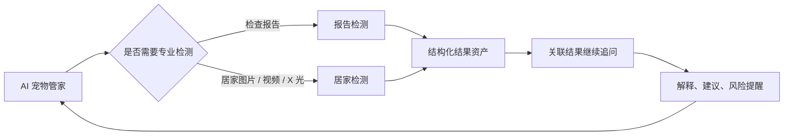
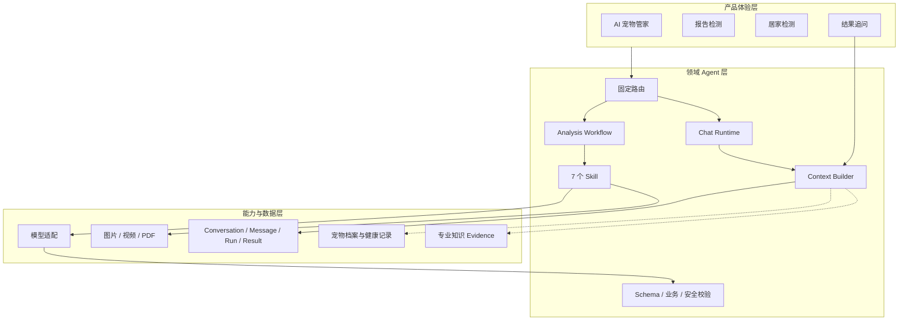
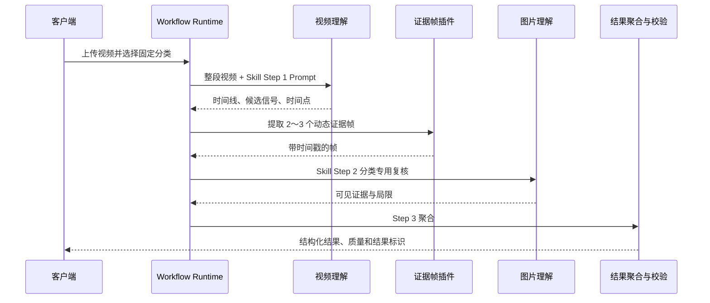

# Project F AI 宠物管家 Agent 设计文档

> 文档版本：v2.0  
> 更新日期：2026-08-07  
> 产品名称：Fura-AI宠物管家  
> 文档范围：产品定位、领域 Agent 设计、能力框架、Demo 技术承接、Context Builder、多模态工作流与演进路线  
> 配套文档：`PROJECTF-AGENT-IMPLEMENTATION.md`

## 1. 文档摘要

Project F AI 宠物管家 Agent 是面向宠物健康管理的垂直领域 Agent。它以持续对话承接用户关系，以报告检测和居家检测承接专业任务，以七个 Skill 固化业务能力，并通过固定路由、受控工作流、证据链和结构化校验限制模型的职责边界。

它不是允许模型自由设定目标、自由选择工具的通用 Agent。Project F 的核心诉求是：在宠物健康场景中，让模型只在被验证、被约束、可复核且对用户真正有价值的位置发挥作用。

当前产品已经形成三个互相连接的体验：

1. AI 宠物管家：日常问答、多轮对话、宠物上下文和风险提醒。
2. 报告检测：检查报告图片或 PDF 的结构化识别与解释。
3. 居家检测：牙科、便便、步态、行为和 X 光五类固定检测。

检测结果以可追问的结果资产进入管家会话，再由 `structured-response` Skill 生成前端可直接渲染的五段式回答，构成闭环：



## 2. 项目背景与设计沉淀

### 2.1 Project F 的产品背景

Project F 的长期方向是宠物数字生命平台：通过多模态 AI 理解宠物档案、健康、行为、情绪和成长信息，并连接内容创作、社交、地图服务、智能日程与生命周期管理。

AI 宠物管家在这一体系中承担三种角色：

- 专业养宠顾问：解释报告和日常健康信号，帮助用户整理观察重点。
- 高共情对话伙伴：结合宠物身份和历史上下文持续交流。
- 成长服务入口：未来连接健康趋势、日程、相册、年度回忆和数字分身。

当前版本优先完成最有确定性、最容易验证价值的健康闭环，不把全部长期愿景一次性塞入首期 Agent。

### 2.2 从早期 Demo 到当前产品

当前 Agent 建立在多轮 Project F 验证之上：

| 阶段 | 主要沉淀 | 对当前 Agent 的影响 |
|---|---|---|
| 多模态模型测试 | 图片、文本、语音与报告分析实验 | 验证模型可用性，也暴露 Prompt 分散和输出漂移问题 |
| 宠物档案与报告原型 | 宠物资料、报告 HTML/JSON 展示 | 确立宠物上下文、结构化结果和卡片呈现方式 |
| AI 管家 UX 探索 | 对话、记忆和成长内容概念 | 明确对话是统一入口，专业检测需要独立入口 |
| 居家检测专项 | 五类样本、规则与 Skill | 固定类别、输入模态、专业字段和安全边界 |
| Agent 架构设计 | Skill、Harness、模型适配、插件与快慢通道 | 将单次模型调用升级为受控执行框架 |
| 最小单元 Demo | 两个 Skill、Fake/Real Adapter、媒体和 Schema | 证明软件链路可行，建立可复用技术内核 |
| 当前 1.0 产品 | 桌面端、移动端、七个 Skill、结果追问与持久化 | 将技术单元收敛为完整、多端产品闭环 |

这条演进路线不是重做，而是保留已验证的窄接口，逐层增加产品语义、业务约束和运行治理。

## 3. 产品定位

### 3.1 一句话定位

**Fura-AI宠物管家是以宠物档案和多模态健康信息为上下文、以固定专业 Skill 为能力单元、以持续对话为服务界面的宠物健康陪伴助手。**

### 3.2 目标用户

- 希望理解宠物检查报告，但缺乏专业知识的养宠用户。
- 希望在家记录和初步观察宠物口腔、排便、步态或行为变化的用户。
- 需要持续保存宠物健康记录，并围绕结果继续提问的用户。
- 需要在就医前整理症状、在就医后理解报告与护理建议的用户。

### 3.3 核心价值

- 降低专业信息的理解门槛，将复杂结果转换为结论、证据和行动建议。
- 提供明确的居家观察入口，帮助用户更规范地采集图片和视频。
- 保留检测与对话上下文，减少重复上传和重复描述。
- 对危险信号进行优先提示，同时明确 AI 不替代兽医诊断。
- 将一次性检测工具转变为可持续的宠物健康服务。

### 3.4 产品边界

当前负责：

- 日常养宠问答和多轮对话。
- 宠物档案基础字段注入。
- 报告图片与 PDF 分析。
- 五类居家检测。
- 检测结果保存、展示和关联追问。
- 不确定性表达、医疗边界和就医提醒。

当前不负责：

- 替代兽医确诊、处方或制定治疗方案。
- 由普通图片自动触发专业检测。
- 由模型自行更换检测分类、用户身份或宠物身份。
- 允许 Skill 执行任意命令、访问任意 URL 或安装未知工具。
- 将用户私有健康数据写入公共知识库。

## 4. 核心设计原则

### 4.1 领域 Agent，而非开放式通用 Agent

宠物健康场景更重视分类正确、步骤可复核、输出稳定和风险可控。模型自由规划容易造成检测类别错误、工具越权、资源不可控和医疗责任边界模糊。

因此采用以下职责分工：

| 决策 | 负责人 |
|---|---|
| 用户与宠物身份 | 客户端身份体系和服务端数据层 |
| 专业功能入口 | 用户明确选择 |
| 产品分类到 Skill 映射 | 服务端固定 Route Registry |
| 执行步骤、媒体插件和失败策略 | Workflow Runtime |
| 视觉理解、文本理解和候选内容生成 | 多模态模型 |
| Schema、字段、颜色和安全规则 | 确定性代码校验 |

### 4.2 由产品入口确定任务

客户端展示“报告检测”和五项居家检测，不向用户暴露内部 Skill 名。产品参数被映射为固定 `route_key`，再绑定固定 Skill、输入合同和执行流程。

模型可以在普通对话中推荐用户进入某项功能，但不能未经确认直接运行专业检测。

### 4.3 统一能力语义，多 Runtime 执行

聊天、图片分析和视频分析共享产品身份、Skill、结果格式、宠物上下文和安全规则，但执行方式不同：

- 对话强调低等待和多轮上下文。
- 图片与 PDF 强调视觉质量、完整提取和结构化校验。
- 视频强调长耗时、时间线、证据帧和可恢复执行。

因此设计上统一业务对象和事件语义，同时允许桌面端、云端移动端采用适合自身运行环境的 Runtime。

### 4.4 Skill 是业务能力合同

Skill 不只是 Prompt，而是产品、算法和工程共同维护的能力定义，包含：

- 专业角色、任务目标和禁止事项。
- 明确的工作步骤与输入模态。
- 图片或视频理解 Prompt。
- 输出字段、枚举、颜色和 JSON Schema。
- 医疗安全边界和表达风格。
- 参考配置、验证脚本和示例。

Runtime 从 Skill 读取专业语义；代码负责媒体、路由、状态、重试和校验，避免在不同位置维护两套业务规则。

### 4.5 模型生成候选，代码决定是否可交付

模型输出不是最终事实。所有专业结果都必须经历：

```text
模型候选
→ JSON 提取
→ 字段归一化
→ 系统字段覆盖
→ Schema 与业务语义校验
→ 必要时携带原素材/证据修复一次
→ 再次校验
→ 保存并交付
```

宠物身份、媒体地址、检测类别、结果归属和运行质量由系统提供，模型无权改写。

### 4.6 多模态结果必须有证据链

图片分析需要明确可见位置和特征；报告分析需要保留完整指标；视频分析必须覆盖时间过程，并用时间戳和关键帧支撑结论。

对步态和行为视频，主链路为：

1. 理解整段视频并生成时间线。
2. 动态选择 2～3 个值得复核的时间点。
3. 提取证据帧并逐张进行分类专用复核。
4. 聚合全局动态结论和局部视觉证据。
5. 完整视频不可用时，使用覆盖全时段的顺序帧降级，并显式标记质量。

### 4.7 检测结果是上下文资产

检测完成后生成结果标识，并绑定用户、宠物和会话。用户继续追问时，系统加载原检测结果、宠物档案、近期对话和相关历史，再执行 `structured-response` Skill。

这使检测不再是一次性工具：

```text
检测 → 结果资产 → 保存/关联 → 管家追问 → 行动建议 → 后续观察
```

### 4.8 产品身份与底层实现隔离

对外统一使用“Fura-AI宠物管家”身份。客户端结果、持久化历史和公共错误中不暴露底层模型、服务商、接口地址、系统 Prompt 或运行提供方。

该设计同时服务于产品一致性、安全和供应商可替换性。

## 5. 产品能力框架



其中实线表示当前已具备或已部分实现的链路，虚线表示仍需接入的生产能力。

### 5.1 用户体验层

- AI 宠物管家：负责关系、咨询和持续对话。
- 报告检测：负责检查报告的完整识别和解释。
- 居家检测：负责五类固定的多模态观察。
- 结果追问：负责将专业结果重新带回对话。

### 5.2 领域运行层

- Route Registry：把产品意图确定性映射到 Skill。
- Chat Runtime：构建对话上下文并生成回答。
- Analysis Workflow：执行媒体、模型、证据、聚合和校验步骤。
- Skill Registry：加载和管理七项能力定义。
- Context Builder：组装宠物、会话、结果和未来知识证据。
- Validator：将模型候选转换为稳定产品合同。

### 5.3 核心领域对象

| 对象 | 设计职责 |
|---|---|
| User / Owner | 用户身份和数据隔离边界 |
| Pet Profile | 当前宠物身份及基础档案 |
| Conversation | 持续对话容器 |
| Message | 用户或助手的一次消息 |
| Run | 一次聊天或分析执行 |
| Event | Run 进度和流式输出事件 |
| Skill | 可版本化的专业能力定义 |
| Media Asset | 原始媒体及派生页面/帧 |
| Analysis Result | 检测结果、证据、状态和追问入口 |

## 6. 两个大功能与管家追问

### 6.1 报告检测

报告检测使用 `pet-report-analysis` Skill，目标不是只找异常项，而是尽可能完整识别报告内容，再对指标进行解释和分级。

主要能力：

- 支持报告图片和 PDF。
- 提取报告类型、医院、日期和宠物信息。
- 保留指标名称、值、单位、参考范围和状态。
- 输出异常解释、科普和行动建议。
- 对多页报告按页处理后聚合。
- 保存结果并支持继续追问。

### 6.2 居家检测

| 分类 | Skill | 模态 | 核心观察 |
|---|---|---|---|
| 牙科评估 | `home-health-check-dental` | 图片 | 牙结石、牙龈、清洁度和护理建议 |
| 便便分析 | `home-health-check-stool` | 图片 | 颜色、形态、质地和消化健康信号 |
| 步态分析 | `home-health-check-gait` | 视频 | 步伐节律、四肢协调和异常时间证据 |
| 行为评估 | `home-health-check-behavior` | 视频 | 情绪、压力和异常行为时间证据 |
| X 光片解读 | `home-health-check-xray` | 图片、PDF | 影像信息、骨骼、关节和软组织可见表现 |

### 6.3 检测后的管家追问

结果追问明确使用 `structured-response` Skill，不复用普通聊天 Prompt。它接收：

- 当前分析 JSON。
- 用户问题。
- 宠物档案。
- 近期对话。
- 最近健康结果摘要。

输出固定包含：

1. 🤗 暖心开场
2. 🔍 主要发现
3. 📚 简单解释
4. 💡 意见与建议
5. 🌈 温暖结语

正文同时提供高亮词和建议问题，便于客户端按结构渲染。

## 7. Context Builder 设计

### 7.1 目标

Context Builder 决定模型本轮看到哪些信息、信息来自哪里、如何验证权限，以及在上下文预算中如何排序。完整目标包括：

- 当前用户、宠物和会话身份。
- 当前问题、媒体和关联检测结果。
- 近期对话和语义摘要。
- 宠物档案、疾病史、用药、过敏和疫苗。
- 历史报告、居家检测和趋势。
- 经过审核的专业知识证据。
- 来源、时间、新鲜度、权限和 Token Budget。

### 7.2 当前实现

当前两个 Runtime 均已具备 Context Builder 的基础能力，但尚未抽象成一个共享组件。

| 能力 | 桌面端 | 移动/云端 |
|---|---|---|
| 会话与消息 | 本机 JSON 持久化 | D1 持久化 |
| 近期消息 | 最近 12 条 | 最近 10 条 |
| 会话摘要 | 较早消息规则压缩；列表摘要取最近回复 | Conversation 保存最近摘要，不是语义记忆 |
| 宠物档案 | 会话创建时携带快照 | D1 pets 表读取 |
| 普通聊天健康上下文 | 同会话最近 3 个结果摘要 | 同宠物最近 3 个已保存结果 |
| 结果追问 | 当前结果、最近 10 条消息、最近结果 | 当前结果、最近 10 条消息、最近 3 个同宠物结果 |
| 归属校验 | 结果与 Conversation 绑定 | Owner + Pet + Analysis 联合校验 |
| RAG | 未实现 | 未实现 |
| 长期语义记忆 | 未实现 | 未实现 |

移动/云端在持久化和跨会话宠物结果方面更接近目标架构；桌面端仍是单机仓库，但已经从纯内存升级为本机 JSON 历史。

### 7.3 目标 Context Pack

```json
{
  "identity": {"user_id": "", "pet_id": "", "conversation_id": ""},
  "pet_profile": {},
  "current_turn": {},
  "recent_messages": [],
  "conversation_summary": {},
  "long_term_memories": [],
  "current_analysis": {},
  "historical_analyses": [],
  "health_records": [],
  "evidence": [],
  "safety_context": {},
  "context_meta": {"sources": [], "token_budget": 12000}
}
```

### 7.4 五层上下文模型

1. L0 当前任务：问题、媒体、结果标识和任务参数。
2. L1 近期对话：最近若干轮原始消息。
3. L2 会话记忆：语义摘要、稳定事实、用户更正和待确认信息。
4. L3 宠物健康上下文：档案、健康记录、历史检测和趋势。
5. L4 专业证据：审核知识、引用和证据不足说明。

### 7.5 升级原则

- 先抽象统一 `ContextPack` 与 Repository/Port，不立即绑定单一数据库。
- 桌面和云端允许不同存储实现，但 Context 语义应一致。
- 所有健康事实必须携带来源和时间，避免旧信息覆盖新信息。
- 按相关性和风险分配预算，而不是只按消息条数截断。
- 用户更正、病史和用药等长期事实需要独立记忆类型，不能混入普通摘要。

## 8. 多模态工作流设计

### 8.1 图片类工作流

```text
媒体类型与大小校验
→ 图片读取、方向与质量处理
→ 固定分类 Skill Prompt
→ 视觉候选 JSON
→ 系统字段归一化
→ Schema 和业务语义校验
→ 必要时携带原图修复
→ 保存结果
```

### 8.2 报告 PDF

```text
PDF 校验
→ 逐页转换/渲染
→ 每页完整识别
→ 全量指标清单
→ 按原顺序聚合
→ 完整报告 JSON
→ 校验与结果保存
```

### 8.3 步态与行为视频



降级策略必须满足两点：覆盖全时段；明确说明并非完整原生视频理解。不得用静态帧伪装为连续动态证据。

### 8.4 X 光图片与 PDF

X 光 Skill 只描述当前影像可见表现，避免给出确定性诊断。结果需要包含影像局限、必要时的临床复核提醒以及结构化维度。

## 9. Skill 能力体系

当前一期包含七个 Skill：

| Skill | 产品位置 | 作用 |
|---|---|---|
| `pet-report-analysis` | 报告检测 | 报告完整识别与解释 |
| `home-health-check-dental` | 居家检测 | 牙科图片分析 |
| `home-health-check-stool` | 居家检测 | 便便图片分析 |
| `home-health-check-gait` | 居家检测 | 步态视频分析 |
| `home-health-check-behavior` | 居家检测 | 行为视频分析 |
| `home-health-check-xray` | 居家检测 | X 光图片/PDF 解读 |
| `structured-response` | 管家追问 | 结果到五段式回答的转换 |

### 9.1 单一事实源原则

桌面端直接读取 Markdown Skill；移动/云端使用同步生成的 TypeScript Skill 快照。设计目标是桌面 Skill 定义作为受验证的源，移动端通过自动同步生成，不允许人工维护两份内容。

### 9.2 防示例污染

Skill 中的完整示例用于说明 Schema，但不应成为当前素材的事实。运行时会移除或隔离完整示例值，保留字段规则和专业要求，避免模型复制样例中的医院、指标或结论。

## 10. 先前 Agent Demo 的技术承接、延伸与区别

### 10.1 技术承接

先前 Demo 已验证的以下抽象被保留：

- Python + FastAPI + Pydantic 的服务方式。
- `Harness` 的步骤执行与 Trace。
- `SkillDefinition` 和 `SkillRegistry`。
- `MediaArtifact` 和图片/视频预处理。
- Fake/Real Model Adapter。
- JSON 提取、输出校验和本地结果。
- 由代码覆盖模型无权决定的系统字段。

### 10.2 技术延伸

当前 Agent 在旧内核上增加：

- 从两个 Skill 扩展到七个 Skill。
- 从直接传 `skill_name` 扩展为产品 Route Registry。
- 从单一 Harness 扩展为 Chat、Analysis、Structured Response 等 Runtime。
- 从一次性 Task 扩展为 Conversation、Message、Run、Event 和 Result。
- 从固定三帧扩展为整段视频理解与动态证据帧。
- 从图片/视频扩展到多页报告 PDF 和 X 光 PDF。
- 从单机 API 扩展到桌面客户端、Web/Cloud Runtime 和 Android APK。
- 从纯内存扩展到桌面本机 JSON、云端 D1/R2 和持久化视频阶段任务。
- 从模型原始输出扩展到语义质量门、自动修复和身份脱敏。

### 10.3 关键区别

| 维度 | 先前 Agent Demo | 当前 Agent |
|---|---|---|
| 目标 | 软件链路可行性验证 | 完整产品和多端运行验证 |
| 能力入口 | 开发者直接选 Skill | 用户选择产品功能，服务端固定路由 |
| Skill | 报告、步态 2 个 | 一期完整 7 个 |
| 执行器 | 单一线性 Harness | 多 Runtime 与分类专用 Workflow |
| 视频 | 20%/50%/80% 固定抽帧 | 整段理解、动态证据帧、全时段降级 |
| 对话 | 无持续会话 | 多轮对话、历史、结果上下文 |
| 结果 | TaskResponse 和本地 JSON | 结果资产、保存和继续追问 |
| 状态 | 单次任务 | 会话、消息、运行、事件、分析记录 |
| 客户端 | CLI/API | 桌面 Web、移动 Web、Android |
| 存储 | 临时文件/内存 | 桌面 JSON；云端 D1/R2 |
| 验证 | 基础字段 Schema | Schema、颜色、证据、时序、文本长度和身份规则 |

### 10.4 演进结论

旧 Demo 是当前 Agent 的技术验证基座；当前 Agent 是该基座的领域化、产品化、多模态深化和多端实现。两者并非两套无关系统，但当前产品也不是对旧 Demo 的简单 UI 包装。

## 11. 多端产品与运行架构

### 11.1 共同产品合同

桌面端与移动端共享：

- Fura-AI宠物管家产品身份。
- 两个一级功能和五类居家检测。
- 七个 Skill 的业务语义。
- 结果字段、状态颜色和 150 字文本约束。
- 普通聊天、结构化追问和建议问题的呈现逻辑。
- 视频三步证据链。

### 11.2 不同运行实现

| 维度 | 桌面端 | 移动/云端 |
|---|---|---|
| 客户端 | 原生 HTML/CSS/JavaScript 双栏工作台 | React 页面 + Capacitor Android 容器 |
| 服务端 | Python FastAPI | vinext/Next Route + Cloudflare Worker |
| 状态 | 本机 JSON + 内存 Run/Event | D1 持久化 |
| 媒体 | 本机目录 | R2 对象存储 |
| 大视频 | 单请求处理，失败后 12 帧降级 | R2 分片上传、D1 分阶段任务和轮询推进 |
| 身份 | 当前本地 `user_id` | Web 邮箱身份或 Android 设备身份 |
| 分发 | Windows 本机启动 | Web 部署与 Android APK |

多端共享业务合同，但当前仍存在 Python 与 TypeScript 两套运行逻辑。长期应通过契约测试、Skill 自动同步和 Schema 共享降低漂移风险。

## 12. 安全与医疗边界

### 12.1 医疗安全

- 不输出确定性诊断或处方。
- 对呼吸困难、抽搐、昏迷、中毒、大出血和无法排尿等信号优先建议就医。
- 证据不足时说明局限，不补造不可见事实。
- 严重结果明确建议由兽医结合临床检查确认。
- 检测结果用于初步观察和沟通准备，不替代临床判断。

### 12.2 数据和身份

- 结果访问必须验证用户、宠物或会话归属。
- 模型密钥只通过环境变量或平台绑定注入。
- 客户端、公共错误和历史记录不暴露模型及服务商信息。
- 生产环境需补齐数据保留、删除、导出和审计策略。

### 12.3 工具边界

- Skill 不得自行执行命令或拼接任意服务地址。
- 媒体插件、模型适配和存储由受控代码实现。
- 产品入口与服务端路由共同限制可调用能力。

## 13. 当前完成状态

截至 2026-08-07：

- 桌面端完成管家对话、历史管理、报告检测、五类居家检测和结构化追问。
- 桌面端具备本机 JSON 历史持久化、Run/Event、SSE、失败诊断和真实模型适配。
- 移动端完成 React/Capacitor 客户端、Android APK、D1/R2 后端和真实业务 API。
- 移动端大视频采用分片上传、证据帧上传、阶段状态和轮询恢复。
- 两端均执行固定 Skill、字段上限、结构化校验和产品身份保护。
- 桌面端自动化测试 71 项通过；移动端结构与产物测试 10 项通过。

## 14. 当前限制与风险

1. 桌面端 Run 和 SSE Event 仍在单进程内存，重启后不可恢复运行状态。
2. 桌面端本机 JSON 适合单用户，不适合并发写入、权限和审计。
3. 移动/云端已有 D1/R2，但仍缺完整任务队列、统一观测和正式容量验证。
4. 两个 Runtime 分别实现 Python 与 TypeScript 业务逻辑，存在规则漂移风险。
5. Skill 同步机制需要持续校验目录和版本，避免生成快照落后。
6. Context Builder 尚未独立化，没有长期语义记忆和专业 RAG。
7. 当前流式体验在部分链路中是完整生成、校验后再分块传输，不是所有场景都直接透传上游 Token。
8. 真实医学准确率、跨品种鲁棒性和复杂媒体质量仍需 Golden Dataset 与专家评测。

## 15. 推荐演进路线

### 阶段 1：统一合同

- 建立共享 JSON Schema、route manifest 和 Skill version manifest。
- 修复并自动化桌面 Skill 到移动端快照的同步。
- 对两套 Runtime 运行同一组 Golden Input/Expected Contract 测试。

### 阶段 2：Context Builder

- 抽象统一 `ContextPack`。
- 建立宠物档案、健康记录、结果和记忆 Repository/Port。
- 引入语义摘要、事实更正和 Token Budget。

### 阶段 3：专业 RAG

- 建立来源审核、内容版本、混合检索、引用和证据不足降级。
- 用户私有记录与公共专业知识分开索引。

### 阶段 4：运行治理

- 桌面端继续保持本地模式；云端补齐队列、幂等、死信、恢复和监控。
- 建立模型调用、时延、Token、降级率和质量指标。
- 对 Skill、模型和知识索引进行版本化灰度与回滚。

### 阶段 5：长期宠物管家

- 健康趋势对比、智能日程和复查提醒。
- 实时语音和更完整的视频理解。
- 成长内容、相册、年度回忆和数字分身联动。

## 16. 设计验收原则

后续任何新增能力都应满足：

- 用户可以理解自己正在启动什么功能。
- 路由和权限不由模型决定。
- Skill、输入、步骤和输出合同明确。
- 专业结论具有可追溯证据或明确局限。
- 结果能被前端稳定消费，并可进入后续上下文。
- 失败可诊断、可重试、可降级或明确终止。
- 模型、Skill、知识和代码版本可追踪。
- 私有健康数据不跨用户泄露。

## 17. 设计结论

Project F Agent 的核心不是增加一个聊天框，而是把对话、宠物档案、多模态检测、结构化结果和后续服务组织成一个受控的宠物健康闭环。

先前 Demo 证明了 Skill、Harness、媒体和模型适配可以组成最小分析链；当前 1.0 则完成了产品路由、多端客户端、七项 Skill、证据视频、结果追问和持久化的延伸。下一阶段的重点应从“继续增加独立功能”转向“统一 Context、Skill、Schema、状态和质量治理”，让两端共享同一套可验证的领域能力。

## 18. 设计依据

- `ProjectF_Agent需求文档_V1.0.md`
- `ProjectF_Agent框架需求文档_V1.0.md`
- `ProjectF_Agent整体架构设计_V1.0.md`
- `ProjectF_Agent技术选型文档.md`
- `ProjectF_Agent最小单元Demo测试文档.md`
- 先前 Agent Demo 代码与测试
- `ProjectF-Agent1.0-Desktop/PROJECTF_AGENT.md`
- 当前桌面端、移动/云端和 Android 实现
