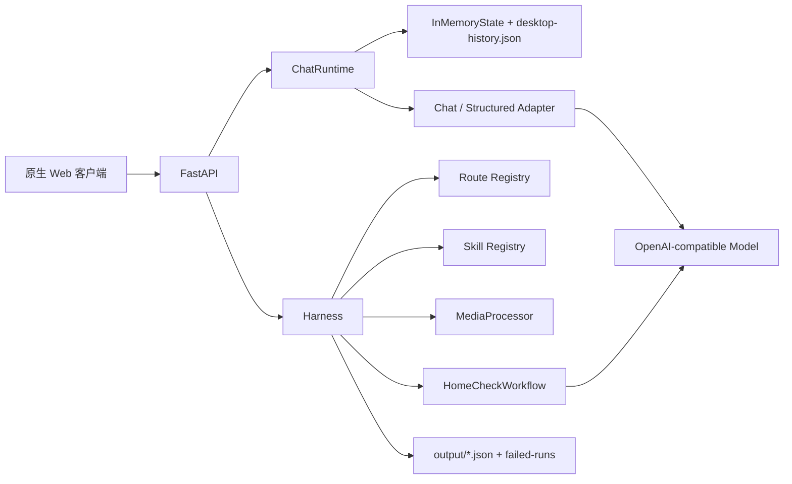
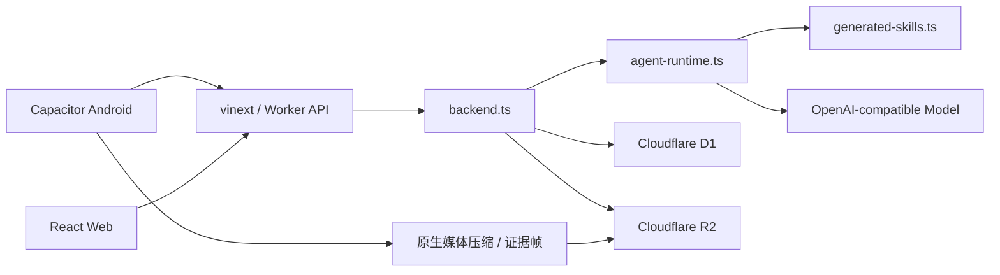

# Project F AI 宠物管家 Agent 实现文档

> 文档版本：v2.0  
> 更新日期：2026-08-07  
> 产品名称：Fura-AI宠物管家  
> 文档范围：当前桌面端、移动/云端与 Android 的代码实现、接口、存储、多模态流程、配置、测试和限制  
> 配套文档：`PROJECTF-AGENT-DESIGN.md`

## 1. 当前实现概览

工作区包含两套共享产品逻辑、但运行环境不同的实现：

| 实现 | 目录 | 技术栈 | 当前定位 |
|---|---|---|---|
| 桌面端 | `ProjectF-Agent1.0-Desktop` | Python、FastAPI、Pydantic、原生 Web、SSE | Windows 本机大屏工作台与完整 Agent 调试运行时 |
| 移动/云端 | `ProjectF-Agent1.0-Mobile` | React、vinext、Cloudflare Worker、D1、R2 | 移动 Web 后端和云端持久化运行时 |
| Android | `ProjectF-Agent1.0-Mobile/android` | Capacitor、原生 Java 插件 | 打包本地 UI、相机/语音/媒体处理并调用私有云端 API |

两套实现共享以下产品合同：

- Fura-AI宠物管家产品身份。
- 报告检测和五项居家检测。
- 七个 Skill 名称与专业规则。
- 结构化结果、状态颜色和 150 字字段上限。
- 检测结果保存和结构化追问。
- 步态/行为的三步视频证据链。

两套实现目前没有共用同一个后端代码包：桌面端为 Python Runtime，移动/云端为 TypeScript Runtime。因此实现文档会分别描述，再列出一致性和差异。

## 2. 目录结构

```text
Agent Demo/
├── PROJECTF-PLATFORMS.md
├── PROJECTF-AGENT-DESIGN.md
├── PROJECTF-AGENT-IMPLEMENTATION.md
├── ProjectF-Agent1.0-Desktop/
│   ├── app/
│   ├── config/
│   ├── skill-definitions/
│   ├── static/
│   ├── tests/
│   ├── runtime/
│   ├── output/
│   └── 启动电脑端.bat
└── ProjectF-Agent1.0-Mobile/
    ├── app/
    ├── lib/
    ├── db/
    ├── drizzle/
    ├── worker/
    ├── mobile/
    ├── android/
    ├── tests/
    └── Fura-AI宠物管家-Android.apk
```

## 3. 共享业务能力

### 3.1 Skill 清单

| Skill | 产品入口 | 输入 |
|---|---|---|
| `pet-report-analysis` | 报告检测 | 图片、PDF |
| `home-health-check-dental` | 居家检测 / 牙科 | 图片 |
| `home-health-check-stool` | 居家检测 / 便便 | 图片 |
| `home-health-check-gait` | 居家检测 / 步态 | 视频 |
| `home-health-check-behavior` | 居家检测 / 行为 | 视频 |
| `home-health-check-xray` | 居家检测 / X 光 | 图片、PDF |
| `structured-response` | 检测结果继续追问 | 分析 JSON + 问题 + 上下文 |

### 3.2 固定产品路由

| Route | Skill | 通道语义 | 超时基线 |
|---|---|---|---|
| `report.general` | `pet-report-analysis` | `analysis-image` | 120 秒 |
| `home_check.dental` | `home-health-check-dental` | `analysis-image` | 120 秒 |
| `home_check.stool` | `home-health-check-stool` | `analysis-image` | 120 秒 |
| `home_check.gait` | `home-health-check-gait` | `analysis-video` | 180 秒 |
| `home_check.behavior` | `home-health-check-behavior` | `analysis-video` | 180 秒 |
| `home_check.xray` | `home-health-check-xray` | `analysis-image` | 180 秒 |

桌面端由 `RouteRegistry` 显式维护；移动端由 `agent-runtime.ts` 中的固定 `ROUTES` 维护。

### 3.3 输出约束

- 普通对话输入最多 150 字。
- 普通对话回复最多 150 字。
- 专业结果中的每个字符串字段最多 150 字且必须单行。
- 结构化追问固定五段，标题顺序不可改变。
- 状态标签、严重程度和 UI 颜色需要满足分类规则。
- 视频维度必须包含时间或全程证据。
- 不得在公共结果中暴露模型、服务商、接口或系统 Prompt。

## 4. 桌面端实现

### 4.1 运行架构



FastAPI 应用版本为 `0.4.0`，桌面资源构建标识为 `desktop-1.4.19`。二者分别表示 API/应用版本和桌面资源版本，不应混为同一个版本号。

### 4.2 核心模块

| 文件 | 职责 |
|---|---|
| `app/api.py` | 健康、Skill、路由、会话、SSE、Run 和分析 API |
| `app/chat_runtime.py` | 上下文组装、普通聊天、结果追问和事件输出 |
| `app/chat_adapter.py` | Fake 管家和真实 OpenAI 兼容聊天适配 |
| `app/state.py` | 会话、消息、Run、Event、结果和本机 JSON 持久化 |
| `app/route_registry.py` | 产品分类到 Skill 的固定映射 |
| `app/harness.py` | 专业分析总入口、步骤 Trace、校验修复和失败诊断 |
| `app/home_check_workflow.py` | 五项居家检测的分类专用插件工作流 |
| `app/model_adapter.py` | 报告/视觉模型、原生视频与 Fake Adapter |
| `app/media.py` | 图片、视频、PDF 校验、转码和抽帧 |
| `app/structured_response.py` | 结果压缩、五段式生成、Schema 和质量门 |
| `app/validators.py` | 报告/居家结果的业务与语义校验 |
| `app/skill_loader.py` | Markdown Skill 扫描与注册 |
| `app/skill_prompt.py` | 运行时 Skill 去示例化，防止样例污染 |
| `app/identity.py` | 产品身份 Prompt、字段移除、文本脱敏和公共错误 |
| `app/config.py` | 模型环境变量和本地忽略配置加载 |

### 4.3 数据模型

#### PetContext

```text
pet_id, pet_name, avatar, species, breed, age_years, weight_kg, sex
```

#### Conversation

```text
conversation_id, user_id, pet, title, mode, summary, created_at, updated_at
```

#### Message

```text
message_id, conversation_id, role, text, run_id,
reply_to_result_id, structured_reply, created_at
```

#### Run

```text
run_id, run_type, route_key, user_id, pet_id,
conversation_id, message_id, status, error, timestamps
```

Run 状态：

```text
accepted → context_building → generating → validating → completed
                                              └→ failed / cancelled
```

#### AnalysisResultRecord

```text
result_id, task_id, source_type, skill_name,
conversation_id, result, created_at
```

### 4.4 状态与持久化

`InMemoryState` 是桌面端统一仓库。应用正常启动时加载并写入：

```text
runtime/desktop-history.json
```

当前持久化：

- Conversation。
- Message。
- AnalysisResultRecord。

当前不持久化：

- 正在运行或已完成的 Run。
- RunEvent 和 SSE sequence。
- 幂等索引、取消集合和活动任务状态。

写入使用临时文件后原子替换；历史文件损坏时不会阻止客户端启动，而是回到空历史。加载和保存时会执行模型身份脱敏。历史列表自动过滤空会话，支持用户、宠物 ID、宠物名称筛选和会话删除。

这仍是单机仓库，不适合多进程并发或多用户生产部署。

### 4.5 Context 构建

普通聊天：

```text
读取最多 50 条消息
→ 最近 12 条作为原始历史
→ 较早消息规则压缩为最多 3000 字摘要
→ 加入 Conversation 的 PetContext
→ 加入同会话最近 3 个检测结果摘要
→ 调用 Chat Adapter
```

结构化追问：

```text
reply_to_result_id
→ 校验 Result 属于当前 Conversation
→ 压缩完整分析 JSON，但保留全部指标/维度
→ 加入最近 10 条消息
→ 加入最近 3 个其他检测摘要
→ structured-response Skill
```

当前没有独立 `ContextBuilder` 类；职责分布在 State、ChatRuntime、ChatAdapter 和 StructuredResponse 中。

### 4.6 普通聊天与 SSE

消息提交返回 HTTP 202 和 `run_id`，后台任务执行聊天。客户端再订阅 Conversation SSE。

事件包括：

| 事件 | 内容 |
|---|---|
| `run.accepted` | 消息与 Run 已创建 |
| `run.context_building` | 开始构建上下文 |
| `context.ready` | 消息数、摘要长度、宠物与响应模式 |
| `analysis_context.ready` | 最近检测上下文数量 |
| `run.generating` | 生成中 |
| `token.delta` | 普通回答文本分块 |
| `structured.segment` | 结构化追问段落 |
| `structured.suggested_questions` | 推荐追问 |
| `message.completed` | 最终消息和可选结构化 JSON |
| `run.completed/failed/cancelled` | Run 终态 |

实现细节：真实聊天适配器会读取上游流，但 `ChatRuntime` 会先聚合、身份脱敏和执行 150 字校验，然后再以 12 字左右分块写入 SSE。因此当前是“经验证后的流式展示”，不是上游 Token 的无缓冲直通。

### 4.7 分析 Harness

基础步骤：

```text
load_skill
→ prepare_media
→ model_analysis 或 HomeCheckWorkflow
→ normalize_result
→ validate_output
→ save_result
```

若真实模型候选校验失败：

```text
原候选 + 校验错误 + 原媒体/工作流证据
→ repair_output_with_media / repair_output_with_evidence
→ normalize_repaired_result
→ stabilize_repaired_output
→ validate_repaired_output
```

修复再次失败则终止，不向客户端展示不符合合同的结果。

每一步保存 `step_id`、状态、耗时和失败详情。失败任务额外写入：

```text
runtime/failed-runs/<task-id>.json
```

### 4.8 居家检测插件配置

配置文件：

```text
config/home-check-plugins.yaml
```

全局插件：

| 插件 | 当前实现 |
|---|---|
| `image_understanding` | Qwen Vision；超时 180 秒；配置重试 2 次 |
| `video_understanding` | 原生 `video_url`；150 秒；最多 2 次；失败使用 12 帧顺序分析 |
| `evidence_frame_extractor` | FFmpeg，目标 3 帧 |
| `result_composer` | Qwen JSON，超时 180 秒 |

所有分类的 `prompt_source` 为：

```text
skill.visual_recognition_prompt
```

程序从对应 Skill 的“视觉识别 Prompt 指令”代码块读取原文。

### 4.9 图片与 PDF 流程

牙科、便便：

```text
单图校验 → Skill 视觉 Prompt → 直接结构化图片分析 → 校验
```

报告 PDF：

```text
pdftoppm -jpeg -r 200
→ 按页生成图片
→ 报告模型分析全部页面
→ 输出完整指标
```

X 光 PDF：

```text
pdftoppm -jpeg -r 200
→ 逐页影像观察
→ 结果聚合
→ X 光 Schema 与医疗边界校验
```

### 4.10 视频流程

步态与行为真实模式：

```text
Step 1 原生完整视频理解
├── 按分类设置 FPS：步态 10.0，行为 4.0
├── 单次等待 150 秒
├── 失败自动重试一次
└── 两次失败后提取 12 帧覆盖全时段并降级理解

Step 2 从候选时间点选取 2～3 帧
├── FFmpeg 提取
├── 每帧使用 Skill 原视觉 Prompt
└── 逐帧视觉复核与重试

Step 3 聚合
├── 视频时间线
├── 关键帧可见证据
├── 质量与局限
└── 结构化结果校验
```

对外 `analysis_runtime` 只保留产品安全字段：完整/降级质量、FPS、时间戳、顺序帧数、尝试次数、降级原因、Prompt 来源和已完成步骤，不保留提供商或模型身份。

### 4.11 上传策略

- `original`：原始质量，单文件最大 50MB。
- `smart`：视频源最大 100MB；超过 50MB 时压缩至目标范围。
- 客户端建议视频 5～15 秒。
- 压缩失败与分析失败使用不同错误阶段，源文件保留供重试。

### 4.12 结果校验

桌面 Validator 覆盖：

- 必填字段和对象结构。
- 所有字符串 150 字限制。
- 报告指标、摘要、建议完整性。
- 居家维度数量、标题和状态。
- 分类专用状态颜色映射。
- `severity` 与 `severity_color` 一致性。
- 图片结果的可见证据用词。
- 视频结果的时间证据和降级表达。
- X 光红色结果的临床检查边界。

### 4.13 桌面 API

| 方法 | 路径 | 作用 |
|---|---|---|
| GET | `/health/live` | 存活检查 |
| GET | `/health/ready` | 构建、Skill、路由和能力状态 |
| GET | `/v1/skills` | 已加载 Skill |
| GET | `/v1/routes` | 固定产品路由 |
| POST | `/v1/conversations` | 创建会话 |
| GET | `/v1/conversations` | 历史会话筛选 |
| GET | `/v1/conversations/{id}` | 会话详情 |
| DELETE | `/v1/conversations/{id}` | 删除会话及关联结果 |
| GET | `/v1/conversations/{id}/messages` | 查询消息 |
| POST | `/v1/conversations/{id}/messages` | 发送消息或结果追问 |
| GET | `/v1/conversations/{id}/events` | SSE 事件 |
| GET | `/v1/runs/{id}` | 查询 Run |
| POST | `/v1/runs/{id}/cancel` | 取消 Run |
| POST | `/v1/analysis/report/{category}/tasks` | 路径型报告任务 |
| POST | `/v1/analysis/home-check/{category}/tasks` | 路径型居家任务 |
| POST | `/v1/analysis/report/{category}/upload` | 上传报告 |
| POST | `/v1/analysis/home-check/{category}/upload` | 上传居家媒体 |

`/v1/agent/tasks` 和 `/v1/agent/tasks/upload` 仅用于旧 Demo 迁移兼容，已标记 deprecated。

### 4.14 桌面客户端

- 双栏宽屏布局。
- 功能入口位于主动关怀卡片上方。
- 报告检测与五项居家检测独立入口。
- 图片、视频、PDF 上传和拍摄指南。
- 智能压缩/原始质量切换。
- 处理状态、失败弹窗、原素材重试。
- 结果卡片、状态颜色、全部报告指标。
- 一键回到管家继续追问。
- 历史记录全部/当前宠物筛选、详情、继续和删除。

### 4.15 桌面启动

要求 Python 3.12。可双击：

```text
ProjectF-Agent1.0-Desktop/启动电脑端.bat
```

或命令启动：

```powershell
cd "ProjectF-Agent1.0-Desktop"
.\.venv\Scripts\python.exe -m app serve --host 127.0.0.1 --port 8000
```

客户端：`http://127.0.0.1:8000`  
OpenAPI：`http://127.0.0.1:8000/docs`  
启动错误日志：`.runtime/server-error.log`

## 5. 移动/云端实现

### 5.1 运行架构



### 5.2 前端与 Android

- React 19 + Next 16 API 形态，由 vinext 构建。
- Capacitor 8 打包 Android，本地 UI 放入 `android-web`。
- 包名：`com.fura.aipetbutler`。
- 最低 Android 7.0 / API 24。
- WebView 调试关闭、明文流量关闭、备份关闭。
- 权限包含网络、相机和录音。
- 使用自定义 `FuraMediaPlugin` 和 Media3 Transformer 进行智能视频压缩。
- 支持语音识别、相机采集、文件选择和 PDF 检查。

### 5.3 云端模块

| 文件 | 职责 |
|---|---|
| `app/page.tsx` | 完整移动产品交互 |
| `lib/mobile-api.ts` | Web/Android 请求、身份头、分片上传、轮询和重试 |
| `lib/media-processing.ts` | 图片处理、视频信息、关键帧、PDF 检查和原生压缩桥接 |
| `lib/backend.ts` | D1/R2 数据、会话、分析、上传和视频阶段任务 |
| `lib/agent-runtime.ts` | 固定路由、模型调用、分析、校验、追问和聊天 |
| `lib/generated-skills.ts` | 从受验证 Skill 生成的 TypeScript 快照 |
| `lib/identity.ts` | 产品身份和公共数据脱敏 |
| `db/schema.ts` | Drizzle/D1 表定义 |
| `worker/index.ts` | Cloudflare Worker 入口、Bindings 和 CORS |

### 5.4 D1 数据表

| 表 | 作用 |
|---|---|
| `pets` | 用户的宠物档案 |
| `conversations` | 会话、摘要、状态和软删除 |
| `messages` | 用户/助手消息、关联分析和结构化 JSON |
| `analyses` | 检测结果、Skill、媒体引用、Trace 和保存状态 |
| `analysis_uploads` | R2 分片上传会话与状态 |
| `analysis_evidence` | 视频证据帧、时间戳和 R2 Key |
| `analysis_video_jobs` | 视频 observation/evidence/composition 阶段、lease 和重试 |

### 5.5 用户身份

Web 优先使用托管环境注入的用户邮箱。Android 使用 `X-FURA-Device-ID` 中的 UUID，并转换为：

```text
android:<device-uuid>
```

所有会话、宠物、消息、分析和媒体查询都以 Owner 为数据隔离边界。生产环境仍需要正式账户迁移和跨设备身份合并方案。

### 5.6 移动端 Context

普通聊天会加载：

- D1 中当前宠物档案。
- 当前会话最近 10 条消息。
- 当前宠物最近 3 个已保存检测结果。
- 当前用户问题。

结果追问会加载：

- 当前 Analysis 完整结果。
- 当前宠物档案。
- 当前会话最近 10 条消息。
- 当前宠物最近 3 个其他检测摘要。

关联结果必须同时匹配 Owner 和 Pet。会话摘要目前是最近回复的裁剪内容，不是语义化长期记忆。

### 5.7 移动 API

| 方法 | 路径 | 作用 |
|---|---|---|
| GET | `/api/bootstrap` | 宠物、活动会话、消息、历史和主动关怀 |
| POST | `/api/pets` | 创建宠物 |
| POST | `/api/chat` | 普通聊天或结构化追问 |
| GET | `/api/history` | 历史列表 |
| POST | `/api/history` | 归档当前会话并创建新会话 |
| GET | `/api/history/{id}` | 会话详情 |
| DELETE | `/api/history/{id}` | 软删除会话 |
| POST | `/api/analysis` | 小媒体直接分析 |
| GET | `/api/analysis/{id}/media` | 受身份保护的媒体访问 |
| POST | `/api/analysis/{id}/save` | 保存检测结果 |
| POST | `/api/analysis-uploads` | 初始化大文件分片上传 |
| PUT | `/api/analysis-uploads/{id}/parts/{part}` | 上传 R2 分片 |
| PUT | `/api/analysis-uploads/{id}/evidence/{frame}` | 上传视频证据帧 |
| POST | `/api/analysis-uploads/{id}/complete` | 完成上传并开始分析 |
| GET | `/api/analysis-uploads/{id}/status` | 推进/查询视频阶段任务 |

### 5.8 移动媒体策略

- 分析输入目标上限：50MB。
- 视频源文件上限：100MB。
- 推荐视频时长：5～15 秒；超过 15 秒拦截，小于 5 秒提示确认。
- Android 智能模式使用原生 Transformer 压缩至 50MB 内。
- 图片最长边按规则处理，输出高质量 JPEG。
- 加密 PDF 明确拒绝。
- 报告 PDF 最多 10 页。
- X 光 PDF 客户端限制 20MB。

当前移动 Runtime 对报告 PDF 遍历全部页面，对 X 光 PDF 只处理第 1 页；这是与桌面端逐页 X 光处理不同的实现边界。

### 5.9 R2 分片上传

步态和行为视频总是进入耐久上传流程：

```text
客户端初始化 upload
→ 按约 5MB 分片上传至 R2 Multipart
→ 上传客户端生成的证据帧
→ complete 合并对象
→ D1 标记 analyzing 并创建 video job
→ 客户端轮询 status
```

网络失败具备客户端重试；任务等待总窗口为 8 分钟，连续网络失败达到阈值后终止并给出明确提示。

### 5.10 耐久视频阶段任务

D1 中的视频任务状态：

```text
observation → evidence → composition → completed
        └───────────────→ failed
```

- 每个状态使用 `lease_until` 防止重复执行。
- 每个模型阶段请求约 50 秒超时。
- 阶段失败最多累计 3 次。
- observation 阶段可使用不同 FPS 质量档重试。
- 服务器返回目标时间点后，客户端从真实视频提取动态证据帧并上传。
- composition 要求每个视频维度引用真实秒数。

该设计避免在一次 Worker 请求中完成整个长视频流程，提高超时后的可继续性。

### 5.11 移动聊天输出

- Web 请求使用 SSE 事件格式：`token.delta`、`structured.segment`、`structured.suggested_questions`、`message.completed`。
- Android 原生请求通过 CapacitorHttp 获取完整 JSON 响应，当前不是 Token 级网络流。
- 服务端先生成并写入 D1，再对 Web 分块输出，因此 Web 当前也是经生成和校验后的流式展示。

### 5.12 Skill 快照

移动 Runtime 不在运行时读取 Markdown 文件，而使用：

```text
lib/generated-skills.ts
```

该文件由仓库内 `skill-definitions/` 中的受验证 Skill 自动生成。修改 Skill 后运行 `npm run skills:sync`，并将生成快照与 Skill 源文件一同提交。

### 5.13 构建和 APK

要求 Node.js 22.13 或更高。

```powershell
cd "ProjectF-Agent1.0-Mobile"
npm run build
npm run mobile:build
npm run android:sync
npm run android:apk
```

生成 APK：

```text
ProjectF-Agent1.0-Mobile/Fura-AI宠物管家-Android.apk
```

云端绑定：

- `DB`：Cloudflare D1。
- `MEDIA`：Cloudflare R2。
- 模型 URL、Key 和模型名：环境/平台 Secret。

## 6. 模型接入与配置

两端均使用 OpenAI `chat/completions` 兼容协议。配置项：

```text
AGENT_MODEL_BASE_URL
AGENT_MODEL_API_KEY
AGENT_MODEL_NAME
```

桌面端可从忽略提交的本地 `.env` 或环境变量读取；云端由 Worker 环境绑定。任何文档、Skill、前端、日志和仓库文件都不应包含真实 Key。

模型调用职责：

| 场景 | 模式 |
|---|---|
| 普通管家对话 | 文本生成 |
| 报告/图片检测 | 多模态 JSON |
| 视频 Step 1 | 原生视频/流式视频体理解 |
| 视频 Step 2 | 关键帧图像证据复核 |
| 视频 Step 3 | 基于证据的结构化聚合 |
| 结果追问 | `structured-response` JSON |

## 7. 产品身份保护

对外身份固定为：

```text
Fura-AI宠物管家
```

保护覆盖：

- System Prompt 中的身份规则。
- 模型响应文本替换。
- JSON 私有字段移除。
- 历史文件迁移和保存前清理。
- TaskResponse 公共助手名。
- 上游网络或模型异常的公共错误归一化。

不对外公开：模型名、版本、服务商、接口地址、系统 Prompt、运行链路和提供方字段。

## 8. 桌面与移动实现差异

| 维度 | 桌面端 | 移动/云端 |
|---|---|---|
| Runtime | Python | TypeScript |
| Skill 来源 | 运行时 Markdown | 生成后的 TS 快照 |
| 会话存储 | 本机 JSON | D1 |
| Run/Event | 内存 | 视频 Job 持久化；聊天无统一 Run 表 |
| 媒体 | 本机目录 | R2 |
| 用户身份 | 客户端传 `user_id` | Web 邮箱 / Android 设备 ID |
| 视频失败 | 原生重试后 12 帧服务端降级 | 分阶段重试、客户端证据帧和耐久轮询 |
| X 光 PDF | 多页逐页 | 当前只分析第 1 页 |
| Web 流式 | SSE | SSE |
| Android 流式 | 不适用 | 完整 JSON，不是 Token 级流 |
| 结果保存 | 自动进入本机历史 | 分析先生成，用户可显式保存 |

## 9. 测试与验证

### 9.1 桌面端

执行：

```powershell
cd "ProjectF-Agent1.0-Desktop"
.\.venv\Scripts\python.exe -m pytest -q
```

2026-08-07 实测：

```text
71 passed, 1 warning
```

覆盖重点：

- 固定路由、成熟客户端和健康接口。
- 本机历史持久化、筛选、删除和宠物快照。
- 普通聊天、多轮上下文、近期检测和 SSE。
- 报告图片、多页 PDF 与完整指标。
- 五项居家检测和状态颜色。
- 原生视频、重试、动态证据帧和 12 帧降级。
- 修复轮保留原素材和工作流证据。
- X 光图片/PDF。
- 结构化追问、五段式、高亮和跨会话隔离。
- 150 字合同、身份脱敏和失败诊断。

当前有一个 Starlette TestClient/httpx 的弃用警告，不影响测试通过，但升级依赖时需要处理。

### 9.2 移动端

轻量结构与产物验证：

```powershell
cd "ProjectF-Agent1.0-Mobile"
node --test tests/rendered-html.test.mjs
```

2026-08-07 实测：

```text
10 passed
```

覆盖重点：

- 产品页面和 API 路由存在。
- 七个 Skill 快照和真实模型调用路径。
- Android 本地 UI、身份头和权限配置。
- D1/R2 分片上传和视频阶段任务。
- 动态证据帧、语义校验和 150 字合同。
- 相机、智能压缩、异常弹窗和 APK 产物约束。

完整 `npm test` 还会先执行 Web 和移动构建；发布前应同时运行完整构建、Android 同步和目标设备回归。

## 10. 运行与排障

### 10.1 桌面端

常用检查：

```powershell
Invoke-RestMethod http://127.0.0.1:8000/health/ready
Invoke-RestMethod http://127.0.0.1:8000/v1/routes
```

诊断位置：

- 启动错误：`.runtime/server-error.log`
- 分析失败：`runtime/failed-runs/*.json`
- 本机历史：`runtime/desktop-history.json`
- 成功结果：`output/<mode>/*.json`
- 上传与派生帧：`runtime/uploads`、`runtime/frames`

### 10.2 移动端

重点检查：

- D1 中 `analysis_uploads.status`。
- D1 中 `analysis_video_jobs.stage/attempts/error/lease_until`。
- R2 原文件和 `analysis_evidence` 对应帧。
- Android 设备 ID 请求头。
- Worker 的 DB、MEDIA 和模型环境绑定。
- 客户端轮询是否在 8 分钟窗口内持续推进。

## 11. 已知限制与待修订项

1. 移动端使用仓库内 Skill 快照，后续应补充 Skill Hash 和生成快照一致性测试。
2. Python 和 TypeScript 各自实现路由、校验和工作流，存在规则漂移风险。
3. 桌面端 Run/Event 不持久化，重启后无法恢复进行中的聊天或分析。
4. 桌面本机 JSON 没有跨进程锁、账户鉴权和正式审计。
5. 移动视频已具备阶段状态，但还不是独立队列 Worker；状态由轮询请求推进。
6. 移动 X 光 PDF 当前只处理第一页，与桌面端能力不一致。
7. 两端的“流式”主要是生成、校验后分块传输，不是所有场景的上游 Token 直通。
8. Context Builder 仍分散，尚无统一 ContextPack、长期语义记忆和 RAG。
9. 模型质量验证仍需真实脱敏样本、兽医评审和 Golden Dataset。
10. 生产环境还需补齐限流、配额、成本、数据生命周期、删除导出和告警。

## 12. 推荐的工程升级顺序

1. 修复 Skill 同步路径，生成 Skill manifest，并比较两端 Skill Hash。
2. 抽取共享 Route/Schema/Color Contract，建立跨 Runtime 契约测试。
3. 建立独立 ContextBuilder 接口和统一 ContextPack。
4. 为桌面状态增加 Repository 抽象；保留本地实现，允许切换 PostgreSQL/Redis。
5. 将移动视频阶段任务迁移到明确的队列/消费者，轮询只查询状态。
6. 统一两端 PDF、上传和视频质量策略。
7. 接入宠物档案、健康记录和专业 RAG。
8. 建立模型、Skill、Schema、知识版本和端到端 Trace。

## 13. 实现结论

当前代码已经超过早期最小 Demo：它具备两个完整客户端形态、七个 Skill、固定业务路由、多模态证据链、结构化追问、持久化记录、身份保护和较完整的自动化验证。

桌面端更适合作为可观察、可调试的完整 Agent 工作台；移动/云端更接近真实用户运行环境，已经使用 D1、R2 和耐久视频阶段状态。下一步工程重点不是继续复制能力，而是统一两套 Runtime 的 Skill、Schema、Context 和质量合同，消除平台间漂移。
